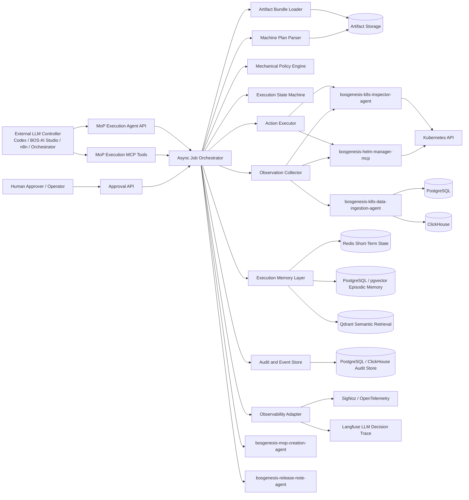
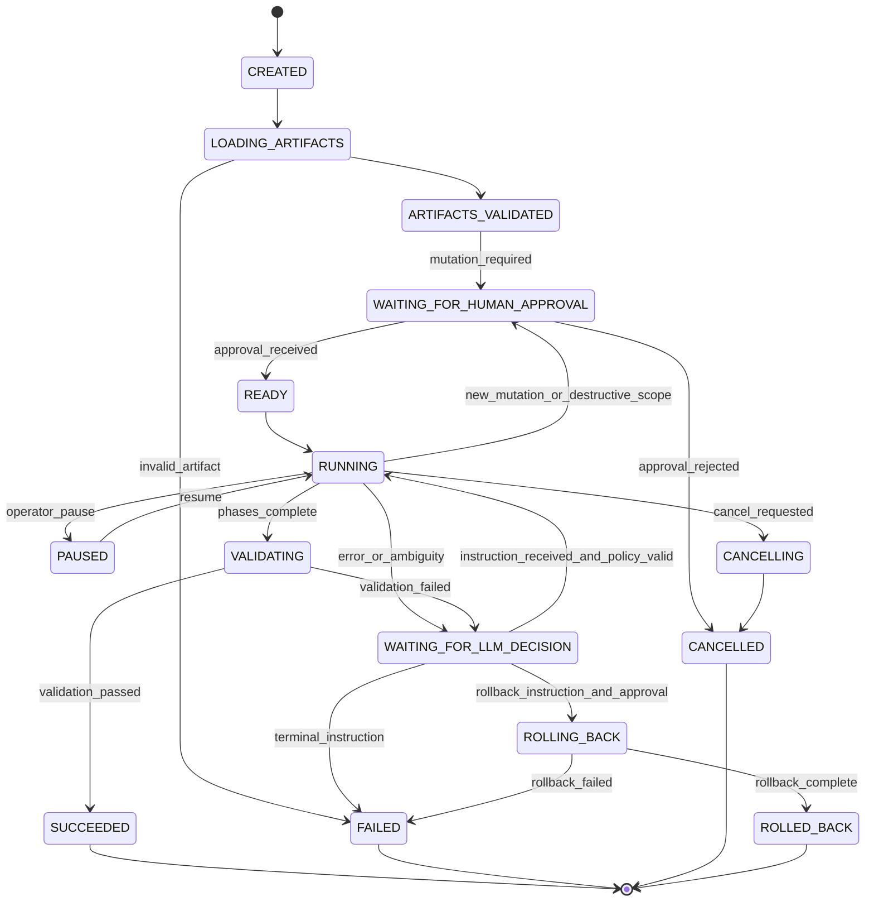
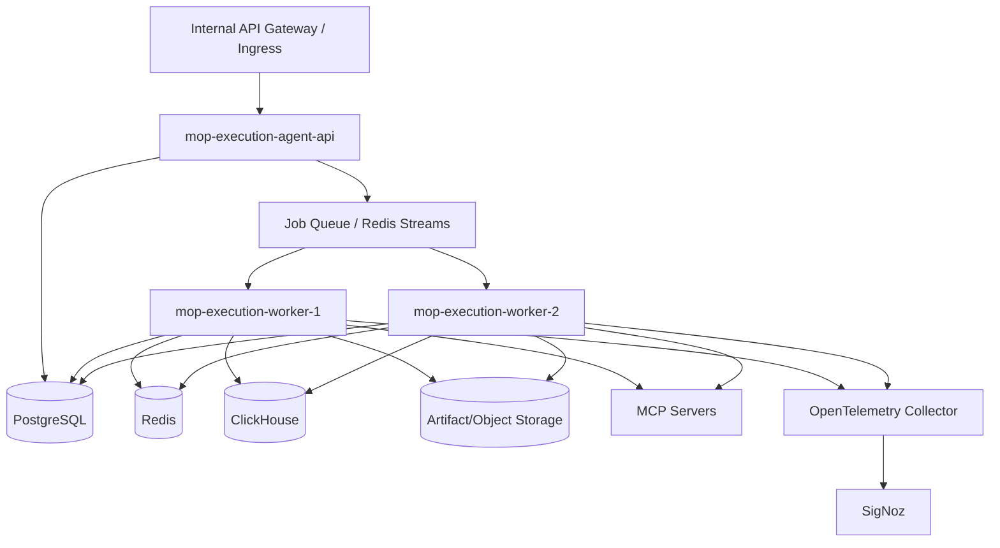

# BOS Genesis MoP Execution Agent - High Level Design

**Document status:** Draft v0.1  
**Agent name:** `bosgenesis-mop-execution-agent`  
**Alternative name:** `bosgenesis-k8s-mop-installer-agent`  
**Primary mode:** Async, long-running, externally controlled execution worker  
**Reasoning posture:** No autonomous reasoning authority  
**Execution posture:** Deterministic worker with strict mechanical guardrails  
**Primary purpose:** Install or recreate Kubernetes and Helm resources into a target namespace from a MoP Creation Agent output bundle.

---

## 1. Executive Summary

The `bosgenesis-mop-execution-agent` is a downstream executor for artifacts generated by `bosgenesis-mop-creation-agent`.

The MoP Creation Agent performs reverse engineering of a source Kubernetes namespace and produces a human-readable Method of Procedure, professional PDF, agent-readable installation notes, generated Kubernetes manifests, and a standalone `machine_execution_plan.yaml`. The MoP Execution Agent consumes those artifacts and performs the actual installation into a target namespace.

The execution agent is intentionally **not a reasoning agent**. It does not infer fixes, decide remediation strategies, reinterpret the MoP, change resource semantics, or choose whether errors are safe to ignore. Instead, it acts as a deterministic, policy-enforcing worker controlled by an external LLM.

The external LLM is the brain. The execution agent is the hands, memory, audit trail, and safety boundary.

Core principle:

```text
The agent may be autonomous in execution, but not autonomous in reasoning.
```

Memory is allowed for continuity, auditability, replay, retrieval, and factual recall. Memory is not allowed to become decision authority.

```text
Memory is allowed to remember.
Memory is not allowed to decide.
```

The agent executes long-running jobs asynchronously, records observations after every action, pauses on ambiguity or failure, and waits for explicit external LLM instructions or human approval before continuing.

---

## 2. Design Context

The current BOS Genesis platform includes multiple MCP servers and agents:

| Component | Role |
|---|---|
| `bosgenesis-helm-manager-mcp` | Manages Helm repositories, rendering, dry-runs, installs, upgrades, history, status, rollback, and uninstall operations. |
| `bosgenesis-k8s-data-ingestion-agent` | Scans Kubernetes namespaces on a schedule and ingests observed data into PostgreSQL and ClickHouse. |
| `bosgenesis-k8s-inspector-agent` | Inspects and manages Kubernetes namespace-scoped resources. |
| `bosgenesis-mop-creation-agent` | Reverse engineers Kubernetes/Helm namespace state and creates MoP artifacts. |
| `bosgenesis-release-note-agent` | Generates release notes, execution summaries, or operational change notes. |
| `bosgenesis-mop-execution-agent` | New worker agent described by this HLD. It executes MoP installation plans under external LLM control. |

The MoP Execution Agent must be able to consume the following artifact types from a MoP output bundle:

| Artifact | Usage by execution agent |
|---|---|
| `machine_execution_plan.yaml` | Canonical machine-readable execution contract and dependency graph. Parsed first. |
| Human-readable MoP Markdown | Human sequencing context, operator-facing intent, validation, rollback, and checklist text. |
| Professional MoP PDF | Human review artifact only; not used as canonical execution input. |
| Machine-readable installation notes Markdown | Supporting context and embedded plan, useful when standalone YAML is unavailable. |
| Generated Kubernetes YAML files | Source of raw Kubernetes resource definitions to apply. |
| Helm values files | Source of Helm value reconstruction input, where applicable. |
| `artifact.json` | Evidence, classification, artifact paths, counts, warnings, source metadata, trace IDs. |
| `artifact-index.json` | File index, generated path inventory, preview/download metadata. |
| `response.json` | High-level generation response and artifact location metadata. |
| Generated resource zip | Portable package containing generated manifests and related resources. |

---

## 3. Goals

The MoP Execution Agent must:

1. Create async execution jobs from a MoP artifact bundle.
2. Parse `machine_execution_plan.yaml` as the primary contract.
3. Read MoP Markdown for sequencing context and human-readable intent.
4. Read generated YAML/values files as the source of Kubernetes and Helm resource content.
5. Execute phases and steps through governed MCP servers.
6. Run dry-runs before any mutating operation.
7. Require human approval before mutating any Kubernetes, Helm, or application system.
8. Stay strictly within the approved target namespace.
9. Never copy production data or raw Kubernetes Secret values.
10. Pause and request external LLM guidance for any non-trivial error or ambiguity.
11. Maintain all layers of execution memory without granting memory any reasoning authority.
12. Persist a complete audit trail of artifacts, commands, instructions, observations, decisions, approvals, retries, and results.
13. Support pause, resume, cancel, retry, rollback, validation, and post-run reporting.
14. Use the release-note agent to create final execution notes after completion, failure, or rollback.

---

## 4. Non-Goals

The MoP Execution Agent must not:

1. Generate the MoP itself.
2. Reverse engineer the source namespace.
3. Infer Helm charts, values, manifests, or dependency order.
4. Decide how to fix errors.
5. Decide whether an error is safe to ignore.
6. Decide whether to skip a failed step.
7. Decide whether to mutate YAML semantics.
8. Decide whether to delete, replace, or force-recreate existing resources.
9. Copy Kubernetes Secret values.
10. Copy production data such as database rows, messages, files, object-store data, Redis values, MongoDB documents, Kafka messages, or business payloads.
11. Perform cluster-scoped changes unless a future version explicitly enables a governed cluster-scope mode.
12. Perform cross-namespace actions outside the approved source/target inspection policy.
13. Use memory retrieval as direct authority for remediation.
14. Execute shell commands directly when an equivalent governed MCP action exists, unless a controlled future local-runner profile is explicitly approved.

---

## 5. Core Design Principle

The worker is brainless, but not unsafe.

```text
“Brainless” does not mean unsafe.
The worker must not infer solutions, but it must enforce schema, scope,
approval, idempotency, redaction, concurrency locks, timeout limits,
and audit logging.
```

The execution agent has deterministic authority only over mechanical checks:

| Area | Worker may decide? | Notes |
|---|---:|---|
| Input schema valid or invalid | Yes | Deterministic validation only. |
| Artifact bundle complete or incomplete | Yes | Based on required files and checksums. |
| Namespace matches job policy | Yes | Block out-of-scope requests. |
| Approval present or missing | Yes | Enforce approval gates. |
| Dry-run required or satisfied | Yes | Enforce before mutation. |
| Secret redaction required | Yes | Always redact. |
| Concurrency lock available | Yes | Enforce one active writer per target namespace. |
| Timeout exceeded | Yes | Mark timed out and pause/fail according to policy. |
| Audit event written | Yes | Must happen for every state transition. |
| How to repair a failure | No | External LLM decides. |
| Whether to retry | No, unless explicit policy or LLM instruction exists | Retries must be instructed or policy-bound. |
| Whether to ignore an error | No | External LLM or human decides. |
| Whether to patch YAML semantics | No | External LLM proposes; human may approve if mutating. |
| Whether to delete PVCs or data-bearing resources | No | Requires explicit instruction and human approval. |
| Whether to roll back | No | External LLM/human decides. |

---

## 6. High-Level Architecture



---

## 7. Responsibility Split

| Layer | Responsibility |
|---|---|
| External LLM Controller | Decides next action, retries, remediation, skip/continue, patch strategy, rollback strategy, and escalation text. |
| Human Approver | Authorizes mutating operations, destructive operations, rollback, namespace creation, and policy exceptions. |
| MoP Execution Agent API | Creates jobs, accepts instructions, exposes status, streams events, records approvals, pauses/resumes/cancels jobs. |
| MCP Interface | Allows Codex or another LLM system to control jobs through tool calls. |
| Artifact Bundle Loader | Loads, validates, indexes, fingerprints, and stages MoP artifacts. |
| Plan Parser | Parses `machine_execution_plan.yaml`, extracts phases, steps, commands, dependency graph, expected outcomes, and constraints. |
| Policy Engine | Enforces deterministic safety controls such as namespace scope, dry-run before mutation, approval gates, redaction, and blocked operations. |
| Execution State Machine | Advances jobs through deterministic states and pauses on errors or missing instructions. |
| Action Executor | Calls governed MCP servers to run Helm and Kubernetes operations. |
| Observation Collector | Collects MCP responses, stdout/stderr, resource state, events, logs, rollout status, Helm status, and validation results. |
| Memory Layer | Stores factual execution context, not reasoning authority. |
| Audit Store | Persists append-only event records and immutable execution history. |
| Observability Adapter | Emits traces, metrics, spans, structured logs, and correlation IDs. |
| Release Note Integration | Sends final execution facts to `bosgenesis-release-note-agent` after completion, failure, or rollback. |

---

## 8. Authority Model

The execution agent must implement a strict authority hierarchy.

```yaml
authority_model:
  external_llm_controller:
    can_decide:
      - next_step
      - retry_strategy
      - wait_strategy
      - repair_strategy
      - patch_strategy
      - skip_or_continue
      - rollback_strategy
      - escalation_summary
    cannot_override:
      - namespace_scope_policy
      - secret_redaction_policy
      - approval_policy
      - audit_policy
      - blocked_action_policy

  human_approver:
    can_authorize:
      - mutating_execution
      - destructive_action
      - rollback
      - namespace_creation
      - pvc_deletion
      - secret_placeholder_creation
      - policy_exception_when_allowed_by_configuration

  worker_agent:
    can_enforce:
      - schema_validation
      - artifact_integrity_validation
      - target_namespace_scope
      - dry_run_before_mutation
      - approval_before_mutation
      - secret_redaction
      - concurrency_locks
      - timeout_limits
      - idempotency_keys
      - audit_event_creation
    cannot_decide:
      - remediation_strategy
      - semantic_manifest_changes
      - whether_to_ignore_errors
      - whether_to_force_replace_resources
      - whether_to_delete_data_bearing_resources
      - whether_to_continue_after_unexpected_state
```

### 8.1 Authority Conflict Handling

When sources disagree, the worker does not reconcile semantically. It pauses and requests instruction.

| Conflict | Worker behavior |
|---|---|
| `machine_execution_plan.yaml` conflicts with human MoP Markdown | Pause with `artifact_conflict_decision_required`. |
| YAML manifest namespace differs from target namespace | Block or rewrite only if the plan explicitly allows namespace rewrite; otherwise pause. |
| Generated YAML conflicts with live resource immutable fields | Pause with observed diff and Kubernetes error. |
| Human instruction conflicts with policy | Block and emit `policy_violation`. |
| External LLM instruction conflicts with approval scope | Pause with `approval_scope_mismatch`. |
| Memory suggests prior remediation | Include as context only; never execute from memory automatically. |

---

## 9. Artifact Consumption Model

### 9.1 Artifact Priority

The agent reads artifacts in this order:

```text
1. machine_execution_plan.yaml
2. machine-readable installation notes Markdown, if standalone plan is missing or incomplete
3. generated Kubernetes manifests and Helm values files
4. artifact.json and artifact-index.json
5. human-readable MoP Markdown
6. response.json
7. PDF only for human review/reference
```

### 9.2 Canonical Sources

| Data | Canonical source |
|---|---|
| Execution phases and dependency graph | `machine_execution_plan.yaml` |
| Resource YAML body | Generated Kubernetes YAML files |
| Helm values | Generated values files |
| Human-readable step titles and context | Human MoP Markdown |
| Evidence, counts, warnings, source snapshot | `artifact.json` |
| Artifact file list | `artifact-index.json` |
| Run metadata and artifact paths | `response.json` |
| Human signoff / review | PDF or Markdown, but approval is stored separately in approval memory |

### 9.3 Artifact Validation

The loader must validate:

- Required files exist.
- YAML files parse correctly.
- `machine_execution_plan.yaml` conforms to the expected schema.
- Target namespace is present and matches the job request.
- Resource manifests are namespace-scoped unless explicitly allowed by a future policy profile.
- Secret values are absent or redacted.
- Generated manifests do not include runtime-only fields that should not be applied.
- Artifact checksums/fingerprints are recorded before execution.
- All referenced files in the machine plan exist.
- All commands or MCP actions are mapped to known safe action types.

---

## 10. Async Execution Model

Execution is long-running and resumable.



### 10.1 Job Execution Loop

```text
create job
load artifact bundle
validate artifact bundle
fingerprint inputs
acquire target namespace lock
parse machine_execution_plan.yaml
build phase/step/action queue
request human approval for mutating scope

for each phase in dependency order:
    for each step in phase:
        validate preconditions
        run dry-run if required
        collect observation
        if dry-run fails:
            pause with decision_required
            wait for external LLM instruction
            continue only after valid instruction and required approval
        run mutation only if dry-run passed and approval exists
        collect observation
        validate expected outcome
        if unexpected result:
            pause with decision_required
            wait for external LLM instruction

run final validation
produce execution summary
call release-note agent
release target namespace lock
close audit trace
```

---

## 11. External LLM Control Contract

The external LLM controls the job by sending explicit instructions.

### 11.1 Observation Envelope from Worker to External LLM

The worker emits facts, not conclusions.

```yaml
observation_envelope:
  schema_version: "1.0"
  job_id: "exec-..."
  phase_id: "apply_configmaps"
  step_id: "apply-configmap-istio-ca-root-cert"
  action_id: "act-..."
  state: "waiting_for_llm_decision"
  target_namespace: "example-target"
  action_attempted:
    type: "k8s_server_side_dry_run"
    resource_ref:
      api_version: "v1"
      kind: "ConfigMap"
      name: "istio-ca-root-cert"
      namespace: "example-target"
    manifest_digest: "sha256:..."
  result:
    status: "failed"
    exit_code: 1
    stdout_redacted: ""
    stderr_redacted: "error: ..."
    mcp_error_code: "k8s_apply_failed"
  observed_cluster_facts:
    existing_resource: true
    events: []
    related_pods: []
    helm_status: null
  policy_context:
    dry_run_required: true
    dry_run_satisfied: false
    approval_required_for_mutation: true
    approval_present: true
    namespace_scope_valid: true
    destructive_action: false
  similar_past_episodes:
    authority: "context_only_not_instruction"
    records: []
  worker_request:
    decision_required: true
    requested_decision_type:
      - "retry"
      - "patch_manifest"
      - "skip_step"
      - "escalate"
      - "rollback"
```

### 11.2 Instruction Envelope from External LLM to Worker

The worker accepts instructions only if they pass mechanical policy validation.

```yaml
instruction_envelope:
  schema_version: "1.0"
  job_id: "exec-..."
  correlation_id: "corr-..."
  issued_by: "external_llm_controller"
  instruction_id: "instr-..."
  based_on_observation_id: "obs-..."
  intent: "retry_with_patch"
  target_phase_id: "apply_configmaps"
  target_step_id: "apply-configmap-istio-ca-root-cert"
  action:
    type: "patch_generated_manifest_then_dry_run"
    patch:
      format: "json6902"
      operations:
        - op: "remove"
          path: "/metadata/resourceVersion"
    dry_run_first: true
    mutate_after_dry_run: false
  constraints:
    target_namespace_only: true
    no_secret_values: true
    no_production_data: true
    require_human_approval_for_mutation: true
  expected_observation:
    success_criteria:
      - "server_side_dry_run_succeeds"
  approval_ref: null
```

### 11.3 Instruction Validation

The worker validates every instruction for:

- Correct job ID.
- Correct current job state.
- Known phase, step, and action target.
- Target namespace match.
- Schema validity.
- Allowed action type.
- No raw secret values.
- No production data payloads.
- No out-of-scope resources.
- Required dry-run flag.
- Required approval reference for mutation.
- Approval scope match.
- Idempotency key or action fingerprint.
- Timeout and retry bounds.

If validation fails, the worker emits a `rejected_instruction` observation and waits for a corrected instruction.

---

## 12. Phase Execution Design

The execution phases follow the machine execution plan. A typical namespace recreation flow is:

| Phase | Purpose | Typical MCP operations |
|---|---|---|
| `verify_access` | Confirm artifact bundle, target namespace intent, MCP connectivity, RBAC, Helm availability. | K8s get namespace, Helm list, artifact validation. |
| `prepare_target_namespace` | Verify or create target namespace if approved. | K8s get/create namespace. |
| `prepare_secret_placeholders` | Create placeholder Secret objects only when explicitly required and approved. | K8s dry-run/apply Secret placeholders with no production values. |
| `apply_configmaps` | Apply generated ConfigMaps. | K8s server-side dry-run/apply. |
| `apply_pvcs` | Apply generated PVCs where safe and approved. | K8s dry-run/apply, observe PVC binding. |
| `install_helm_releases` | Install or upgrade Helm releases using generated values and public repos. | Helm repo add/update, template, dry-run, upgrade/install. |
| `apply_raw_kubernetes_resources` | Apply generated non-Helm raw resources. | K8s dry-run/apply. |
| `apply_ingress` | Apply Ingress resources after services exist. | K8s dry-run/apply, get ingress, events. |
| `apply_application_metadata` | Optional future application metadata mode, no production data. | Disabled unless explicitly enabled. |
| `validate` | Validate target namespace state and readiness. | K8s get/rollout/events/logs, Helm status, data ingestion comparison. |
| `release_notes` | Produce final execution notes. | Release-note agent call. |

The worker does not decide to reorder phases unless the external LLM instructs it and the new order remains compatible with the dependency graph and policy.

---

## 13. MCP Integration Design

### 13.1 Kubernetes Inspector Agent

The execution agent uses `bosgenesis-k8s-inspector-agent` for namespace-scoped Kubernetes operations.

Expected capabilities:

- Get namespace.
- Create namespace when approved.
- Server-side dry-run apply.
- Apply namespace-scoped resources.
- Get resource by kind/name/namespace.
- List resources by namespace.
- Describe resource.
- Read events.
- Read pod logs when needed for observation.
- Check rollout status.
- Delete namespace-scoped resources only under explicit rollback/destructive approval.
- Validate namespace drift after execution.

### 13.2 Helm Manager MCP

The execution agent uses `bosgenesis-helm-manager-mcp` for Helm operations.

Expected capabilities:

- Helm version check.
- Helm repo add/update.
- Helm dependency build/update if allowed.
- Helm template/render.
- Helm dry-run install/upgrade.
- Helm install/upgrade.
- Helm status.
- Helm history.
- Helm get manifest/values.
- Helm rollback when instructed and approved.
- Helm uninstall when instructed and approved.

### 13.3 K8s Data Ingestion Agent

The execution agent uses `bosgenesis-k8s-data-ingestion-agent` for observed current and historical state.

Expected capabilities:

- Fetch latest namespace inventory from PostgreSQL/ClickHouse.
- Compare target namespace state with expected artifact inventory.
- Retrieve recent events and workload transitions.
- Provide historical context for validation and troubleshooting.
- Supply facts to the external LLM as context only.

### 13.4 MoP Creation Agent

The execution agent may call `bosgenesis-mop-creation-agent` to:

- Retrieve a previously generated artifact bundle.
- Preview artifact files.
- Download generated folder archive.
- Validate generation metadata.
- Regenerate a MoP only when explicitly instructed by the external LLM or human operator.

The execution agent does not perform reverse engineering itself.

### 13.5 Release Note Agent

The execution agent calls `bosgenesis-release-note-agent` after terminal states:

- `SUCCEEDED`
- `FAILED`
- `CANCELLED`
- `ROLLED_BACK`

The release-note request includes non-secret execution facts, status timeline, applied resources, skipped resources, warnings, approvals, rollbacks, validation results, and known issues.

---

## 14. Memory Model

All layers of agentic memory exist, but as execution memory, not autonomous reasoning.

```yaml
execution_memory_layers:
  in_run_state_memory:
    purpose: Track current job, phase, step, attempt number, MCP calls, observations, and pending approvals.
    storage: process_memory_plus_durable_checkpoint
    authority: current_execution_state
    reasoning_allowed: false

  durable_job_memory:
    purpose: Persist async job state so execution can resume after restart or long waits.
    storage: postgresql
    authority: current_execution_state
    reasoning_allowed: false

  short_term_session_memory:
    purpose: Store active conversation/job control context, recent observations, pending instruction requests, and open decisions.
    storage: redis
    authority: active_context_only
    reasoning_allowed: false

  resource_state_memory:
    purpose: Record observed Kubernetes and Helm state before, during, and after each action.
    storage: postgresql_or_clickhouse
    authority: observed_cluster_facts
    reasoning_allowed: false

  episodic_execution_memory:
    purpose: Store prior non-secret execution outcomes, failures, LLM instructions, human approvals, and final resolutions.
    storage: postgresql_pgvector
    authority: historical_context_only
    reasoning_allowed: false

  semantic_failure_memory:
    purpose: Retrieve similar past errors and successful externally instructed remediations as context for the external LLM.
    storage: qdrant_or_pgvector
    authority: prior_guidance_only
    reasoning_allowed: false

  policy_memory:
    purpose: Store deterministic guardrails, namespace scope, approval rules, redaction rules, timeout rules, and blocked actions.
    storage: config_plus_postgresql
    authority: enforced_policy
    reasoning_allowed: false

  approval_memory:
    purpose: Record human approvals, rejected actions, approval timestamps, approver identity, and scope of approval.
    storage: postgresql_append_only
    authority: human_authorization_record
    reasoning_allowed: false

  audit_memory:
    purpose: Immutable event log of commands, MCP calls, observations, LLM instructions, policy decisions, approvals, and outputs.
    storage: clickhouse_or_postgresql_append_only
    authority: audit_record
    reasoning_allowed: false

  observability_memory:
    purpose: Store traces, metrics, spans, correlation IDs, durations, retry counts, and failure taxonomy.
    storage: signoz_opentelemetry_langfuse
    authority: operational_telemetry
    reasoning_allowed: false
```

### 14.1 Memory Retrieval Rules

Memory retrieval is allowed only to assemble context for the external LLM.

The worker must tag retrieved memory with:

```yaml
memory_context:
  authority: context_only_not_instruction
  contains_secret_values: false
  can_drive_execution: false
  requires_external_llm_decision: true
```

The worker must never convert retrieved memory into an action without a fresh external LLM instruction and, where needed, human approval.

---

## 15. Safety and Policy Engine

The policy engine is deterministic and non-negotiable.

### 15.1 Required Guardrails

| Guardrail | Enforcement |
|---|---|
| Target namespace only | All resource operations must match the approved target namespace. |
| Namespace lock | Only one active mutating job may target the same namespace at a time. |
| Dry-run before mutation | Every apply/install/upgrade/delete must have a successful dry-run or explicit policy-supported dry-run exemption. |
| Human approval before mutation | No mutating action can run without approval scope covering that action. |
| No Secret value copying | Raw Secret data/stringData from source is blocked and redacted. |
| No production data copying | Data payload migration is blocked. |
| No cluster-scoped resources | Blocked in v1 unless future policy profile enables limited add-only mode. |
| No destructive default | Delete, replace, force, uninstall, PVC deletion, and namespace deletion require explicit destructive approval. |
| Redaction | Secrets, tokens, passwords, keys, kubeconfig content, certificates where configured, and sensitive env vars are redacted from logs and memory. |
| Schema validation | Plans, YAMLs, instructions, observations, and approvals must pass schema validation. |
| Idempotency | Actions must have idempotency keys and manifest/action fingerprints. |
| Timeout limits | Every MCP call, phase, and job must have configured timeout limits. |
| Audit logging | Every state transition and action must produce an audit event. |

### 15.2 Blocked Actions by Default

- Applying cluster-scoped RBAC.
- Creating or modifying CRDs.
- Modifying storage classes.
- Deleting PVCs.
- Deleting namespaces.
- Copying source Secret values.
- Running arbitrary shell scripts.
- Running commands outside governed MCP action types.
- Applying manifests containing another namespace unless explicitly allowed by policy rewrite.
- Applying manifests with suspicious embedded credentials.
- Applying resources not referenced by the approved plan unless externally instructed and approved.

---

## 16. Error Handling and External Reasoning Loop

The worker handles errors mechanically. It classifies the error, records facts, and pauses for external LLM guidance.

### 16.1 Error Categories

| Error category | Example | Worker behavior |
|---|---|---|
| Artifact error | Missing generated YAML, invalid YAML syntax, missing plan step | Pause with artifact validation failure. |
| Schema error | Instruction envelope malformed | Reject instruction and request corrected instruction. |
| Policy violation | Attempt to modify another namespace | Block and emit policy violation. |
| Approval error | Mutation requested without approval | Pause awaiting approval. |
| RBAC/auth error | Service account cannot apply resource | Pause with MCP/Kubernetes error details. |
| Dry-run error | Kubernetes server-side dry-run fails | Pause before mutation. |
| Existing resource conflict | Resource already exists with conflicting fields | Pause with diff/context. |
| Immutable field conflict | PVC/storage/service immutable field mismatch | Pause; no force action. |
| Helm render error | Chart template fails | Pause with Helm output. |
| Helm install error | Release install/upgrade fails | Pause with Helm status/history. |
| Scheduling error | Pod unschedulable, node down, taints, insufficient resources | Pause with events. |
| Storage error | PVC pending, storage class missing | Pause with PVC/events. |
| Readiness error | Deployment rollout timeout, CrashLoopBackOff | Pause with events/logs. |
| Ingress/network error | Ingress class or host conflict | Pause with observed ingress state. |
| Timeout | MCP call or phase exceeds limit | Pause or fail according to configured timeout policy. |
| Validation mismatch | Expected resources not ready after execution | Pause with validation report. |

### 16.2 Decision Required Pattern

For any non-trivial error:

```text
1. Stop before additional mutation.
2. Persist observation.
3. Redact sensitive data.
4. Gather bounded supporting context.
5. Retrieve similar prior non-secret episodes as context only.
6. Emit decision_required event.
7. Wait for external LLM instruction.
8. Validate instruction mechanically.
9. Require human approval if instruction mutates or destroys.
10. Continue only after validation and approval pass.
```

---

## 17. Idempotency and Concurrency

### 17.1 Namespace Locking

Each target namespace has a lock:

```yaml
namespace_lock:
  key: "target_namespace:<namespace>"
  owner_job_id: "exec-..."
  mode: "exclusive_mutation"
  lease_seconds: 300
  renewable: true
  released_on_terminal_state: true
```

Read-only validation jobs may run concurrently if configured. Mutating jobs require exclusive lock ownership.

### 17.2 Action Idempotency

Each action includes:

- `job_id`
- `phase_id`
- `step_id`
- `action_id`
- `manifest_digest`
- `instruction_id`
- `approval_ref`, if applicable
- `target_namespace`
- `mcp_tool_name`
- `dry_run_digest`
- `mutation_digest`

The worker must not re-run a mutating action after restart unless the action is marked retryable by an external LLM instruction and policy permits retry.

---

## 18. Data Model

### 18.1 Core Entities

| Entity | Purpose |
|---|---|
| `ExecutionJob` | Top-level job record. |
| `ArtifactBundle` | Loaded and fingerprinted input artifacts. |
| `ExecutionPhase` | Phase from machine execution plan. |
| `ExecutionStep` | Step within a phase. |
| `ExecutionAction` | Concrete MCP operation or validation action. |
| `Observation` | Result of an action or state check. |
| `LLMInstruction` | External LLM command to continue, retry, patch, wait, skip, rollback, or fail. |
| `HumanApproval` | Human authorization record and scope. |
| `PolicyDecision` | Deterministic allow/block/pause result. |
| `AuditEvent` | Append-only event. |
| `MemoryRecord` | Non-secret execution memory entry. |
| `ValidationReport` | Post-phase or post-run validation result. |
| `ReleaseNoteRequest` | Payload sent to release-note agent. |

### 18.2 Execution Job Schema Sketch

```yaml
execution_job:
  job_id: "exec-..."
  mop_id: "..."
  run_id: "..."
  correlation_id: "..."
  source_namespace: "source-ns"
  target_namespace: "target-ns"
  artifact_bundle_ref: "artifact-bundle-uri-or-path"
  status: "waiting_for_llm_decision"
  current_phase_id: "apply_configmaps"
  current_step_id: "apply-configmap-x"
  created_by: "external_llm_or_user"
  created_at: "2026-06-16T00:00:00Z"
  updated_at: "2026-06-16T00:00:00Z"
  policy_profile: "namespace_only_v1"
  approval_state:
    mutation_approved: true
    approval_refs: []
  lock_state:
    target_namespace_lock_acquired: true
  counters:
    phases_total: 10
    phases_completed: 3
    steps_total: 42
    steps_completed: 17
    errors: 1
    retries: 0
  terminal_summary: null
```

---

## 19. API Surface

### 19.1 REST API

| Method | Path | Purpose |
|---|---|---|
| `POST` | `/execution-jobs` | Create async execution job from artifact bundle. |
| `GET` | `/execution-jobs/{job_id}` | Get job status and current state. |
| `GET` | `/execution-jobs/{job_id}/events` | Stream or page audit events. |
| `GET` | `/execution-jobs/{job_id}/observations` | List observations. |
| `POST` | `/execution-jobs/{job_id}/instructions` | Submit external LLM instruction. |
| `POST` | `/execution-jobs/{job_id}/approvals` | Submit human approval. |
| `POST` | `/execution-jobs/{job_id}/pause` | Pause job. |
| `POST` | `/execution-jobs/{job_id}/resume` | Resume paused job. |
| `POST` | `/execution-jobs/{job_id}/cancel` | Cancel job. |
| `POST` | `/execution-jobs/{job_id}/rollback` | Request rollback; requires instruction and approval. |
| `POST` | `/execution-jobs/{job_id}/validate` | Run validation-only pass. |
| `GET` | `/execution-jobs/{job_id}/artifacts` | List output artifacts. |
| `GET` | `/execution-jobs/{job_id}/report` | Retrieve execution report. |
| `GET` | `/health` | Health check. |
| `GET` | `/config` | Safe configuration inspection. |

### 19.2 MCP Tools

Suggested MCP tool names:

| MCP tool | Purpose |
|---|---|
| `create_mop_execution_job` | Create an execution job. |
| `get_mop_execution_job` | Get job status. |
| `list_mop_execution_events` | Retrieve events. |
| `submit_mop_execution_instruction` | Submit external LLM instruction. |
| `submit_mop_execution_approval` | Submit human approval reference. |
| `pause_mop_execution_job` | Pause job. |
| `resume_mop_execution_job` | Resume job. |
| `cancel_mop_execution_job` | Cancel job. |
| `request_mop_execution_rollback` | Begin rollback flow. |
| `validate_mop_execution_target` | Run validation pass. |
| `get_mop_execution_report` | Retrieve final report. |
| `get_mop_execution_config` | Inspect safe config. |
| `healthcheck_mop_execution_agent` | Health check. |

---

## 20. Storage Design

| Store | Usage |
|---|---|
| Local or object storage | Artifact bundle staging, generated execution reports, redacted logs. |
| PostgreSQL | Jobs, phases, steps, approvals, instructions, current state, durable memory. |
| ClickHouse | High-volume audit/event/observation analytics. |
| Redis | Active job state, locks, queues, short-term context, lease renewal. |
| pgvector | Episodic execution memory and similarity search. |
| Qdrant | Optional semantic failure memory and prior execution retrieval. |
| SigNoz/OpenTelemetry | Traces, spans, metrics, logs correlation. |
| Langfuse | External LLM decision trace metadata, prompt/response hashes, redacted decision context. |

---

## 21. Security Design

### 21.1 Authentication and Authorization

The agent should support:

- Service-to-service authentication for MCP callers.
- Human approver identity binding.
- Role-based authorization for job creation, approval, rollback, cancellation, and configuration access.
- Separate roles for read-only validation and mutating execution.
- Approval scope enforcement.

### 21.2 Kubernetes RBAC

The execution agent should not require broad cluster-admin permissions for v1.

Recommended v1 posture:

- Read access to source namespace only if validation requires source comparison.
- Read/write access to approved target namespace.
- Namespace create permission only if explicitly enabled.
- No cluster-scoped resource mutation.
- No Secret value read from source namespace.
- Secret placeholder creation in target namespace only when approved.

### 21.3 Redaction

Redaction applies before logs, memory, observations, LLM context, release notes, or audit exports.

Redact at minimum:

- Kubernetes Secret `data` and `stringData`.
- Passwords.
- Tokens.
- API keys.
- Private keys.
- Kubeconfig content.
- Authorization headers.
- Connection strings containing credentials.
- Sensitive environment variables.
- Certificate/private-key material according to policy.

---

## 22. Observability and Audit

### 22.1 Trace and Correlation

Each job must carry:

- `job_id`
- `mop_id`
- `run_id`
- `correlation_id`
- `source_namespace`
- `target_namespace`
- `artifact_bundle_digest`
- `external_llm_session_id`, if available
- `human_approval_refs`

### 22.2 Metrics

Key metrics:

- Job count by status.
- Job duration.
- Phase duration.
- Approval wait time.
- LLM decision wait time.
- MCP call latency.
- MCP error rate.
- Dry-run failure count.
- Mutation success/failure count.
- Rollback count.
- Validation failure count.
- Policy violation count.
- Retry count.
- Secret redaction count.
- Namespace lock contention.

### 22.3 Audit Events

Every event should be append-only and immutable.

Required audit events:

- Job created.
- Artifact bundle loaded.
- Artifact validation passed/failed.
- Namespace lock acquired/released.
- Human approval requested/received/rejected.
- External LLM instruction received/rejected/accepted.
- Policy allow/block decision.
- Dry-run started/completed/failed.
- Mutation started/completed/failed.
- Observation recorded.
- Error classified.
- Decision required.
- Rollback requested/approved/started/completed/failed.
- Validation started/completed/failed.
- Release-note generation requested/completed.
- Job reached terminal state.

---

## 23. Deployment Architecture



Recommended deployable units:

| Unit | Purpose |
|---|---|
| API deployment | Accepts REST and MCP control requests. |
| Worker deployment | Runs async execution state machine. |
| Reconciler deployment | Resumes interrupted jobs and renews/reclaims locks. |
| Scheduler/queue | Dispatches job work. |
| PostgreSQL | Durable job state and approvals. |
| Redis | Queue, lock, and short-term state. |
| ClickHouse | Audit/event analytics. |
| Object storage or PVC | Artifact bundle and report storage. |
| OpenTelemetry collector | Trace/log/metric forwarding. |

---

## 24. Configuration

Example configuration shape:

```yaml
agent:
  name: bosgenesis-mop-execution-agent
  mode: async_worker
  reasoning_authority: external_llm_only

policy:
  profile: namespace_only_v1
  require_dry_run_before_mutation: true
  require_human_approval_before_mutation: true
  target_namespace_only: true
  allow_cluster_scoped_resources: false
  allow_secret_value_copy: false
  allow_production_data_copy: false
  allow_namespace_create: configurable
  allow_pvc_delete: false
  allow_force_apply: false

execution:
  max_job_duration_minutes: 240
  max_phase_duration_minutes: 60
  max_mcp_call_duration_seconds: 120
  decision_wait_timeout_minutes: 1440
  lock_lease_seconds: 300
  default_retry_policy: external_instruction_required

mcp:
  k8s_inspector:
    enabled: true
    endpoint: ${K8S_INSPECTOR_MCP_ENDPOINT}
  helm_manager:
    enabled: true
    endpoint: ${HELM_MANAGER_MCP_ENDPOINT}
  data_ingestion:
    enabled: true
    endpoint: ${K8S_DATA_INGESTION_MCP_ENDPOINT}
  mop_creation:
    enabled: true
    endpoint: ${MOP_CREATION_AGENT_ENDPOINT}
  release_note:
    enabled: true
    endpoint: ${RELEASE_NOTE_AGENT_ENDPOINT}

memory:
  redis_short_term_enabled: true
  postgres_durable_enabled: true
  pgvector_episodic_enabled: true
  qdrant_semantic_failure_enabled: true
  memory_can_decide: false

observability:
  otel_enabled: true
  signoz_enabled: true
  langfuse_enabled: true
  structured_logs_enabled: true
```

---

## 25. Validation Strategy

### 25.1 Pre-Execution Validation

- Artifact bundle exists.
- Artifact checksums recorded.
- Machine execution plan parses.
- Dependency graph is acyclic.
- Required generated YAML files exist.
- Target namespace matches request.
- No secret values are present.
- No production data payloads are present.
- MCP connectivity is healthy.
- Kubernetes permissions are sufficient for planned operations.
- Helm permissions and repo access are sufficient for planned operations.
- Human approval exists for planned mutating scope.

### 25.2 Runtime Validation

- Dry-run success before mutation.
- Apply/install response captured.
- Resource exists after apply.
- Helm release status captured after install/upgrade.
- Kubernetes events checked for errors.
- Rollout status checked for deployments/statefulsets/daemonsets where applicable.
- PVC binding observed where applicable.
- Ingress existence and class/host status observed where applicable.

### 25.3 Final Validation

- Target namespace resource inventory matches expected planned resources or approved deviations.
- Helm releases are deployed or approved-skipped.
- Pods are ready or failures are documented and externally approved.
- Services and ingress resources exist as expected.
- No out-of-scope resources were changed.
- Audit trail is complete.
- Release notes are generated.

---

## 26. Rollback Design

Rollback is not automatic reasoning. Rollback must be instructed by the external LLM and approved by a human when mutating or destructive.

Rollback options:

| Rollback type | Description | Approval required |
|---|---|---:|
| Helm rollback | Use Helm history to roll back a release revision. | Yes |
| Helm uninstall | Remove a release installed by this job. | Yes, destructive |
| Raw resource delete | Delete raw resources applied by this job. | Yes, destructive |
| Manifest revert | Apply prior manifest snapshot. | Yes |
| Namespace cleanup | Delete or clean target namespace. | Yes, highly destructive |
| PVC retention | Preserve PVCs even when uninstalling other resources. | Usually default; explicit delete approval required |

The worker must record exactly which resources were created by the job and which existed before the job. This supports safer rollback scoping.

---

## 27. Failure and Recovery

### 27.1 Worker Restart

On restart, the reconciler:

1. Finds non-terminal jobs.
2. Rehydrates durable state.
3. Checks namespace locks.
4. Verifies last action status.
5. Emits `resume_decision_required` if the last mutating action result is unknown.
6. Waits for external LLM instruction before continuing.

### 27.2 Unknown Mutation Outcome

If the worker crashes during a mutation and cannot prove whether the mutation completed, it must not retry blindly. It must:

- Query current resource state.
- Compare to expected manifest digest where possible.
- Emit observation.
- Wait for external LLM instruction.

---

## 28. Testing Strategy

| Test category | Examples |
|---|---|
| Unit tests | Plan parser, policy engine, redaction, schema validation, state transitions. |
| Contract tests | Instruction envelope, observation envelope, approval envelope, MCP request/response mapping. |
| Artifact tests | Valid/invalid MoP bundles, missing files, invalid YAML, namespace mismatch. |
| Policy tests | Secret value blocking, cluster-scoped resource blocking, dry-run enforcement, approval enforcement. |
| State machine tests | Pause/resume/cancel/rollback/timeout/restart. |
| MCP integration tests | Mock K8s Inspector, Helm Manager, Data Ingestion, MoP Creation, Release Note. |
| Failure injection tests | Resource already exists, immutable field, node down, PVC pending, Helm render failure, ingress conflict. |
| Security tests | Redaction, authorization, approval scope, audit immutability. |
| Load tests | Multiple jobs, namespace lock contention, event stream throughput. |

---

## 29. Risks and Mitigations

| Risk | Mitigation |
|---|---|
| External LLM gives unsafe instruction | Policy engine blocks namespace, approval, secret, destructive, and schema violations. |
| Memory begins to act like authority | Memory records are tagged as context-only and never converted to actions without instruction. |
| Job retries unsafe mutation after restart | Idempotency records and unknown-outcome pause prevent blind retry. |
| Human approval too broad | Approval scopes must bind namespace, action types, time window, and destructive permissions. |
| Artifact bundle contains bad YAML | Parser catches syntax/schema errors before execution. |
| Resource already exists | Worker pauses with observed diff and waits for instruction. |
| Node/storage issue causes pods to fail | Worker collects events/logs and pauses for LLM decision. |
| Secret values leak to logs | Redaction at ingress, observation, memory, audit, and outbound LLM context boundaries. |
| Multiple jobs mutate same namespace | Exclusive namespace lock. |
| MCP server partial outage | Job pauses or retries only under configured safe policy/external instruction. |

---

## 30. Future Scope

Potential future enhancements:

1. Multi-namespace execution with explicit dependency graph and approval scoping.
2. Cluster-scoped add-only mode for CRDs/RBAC under stronger approvals.
3. OPA/Gatekeeper or Kyverno policy simulation before execution.
4. Diff-based preview UI for LLM/human approval.
5. Advanced rollback planner with protected PVC/data retention policy.
6. Letta-backed durable memory adapter.
7. Richer semantic failure retrieval across historical execution jobs.
8. Release orchestration across multiple MoP bundles.
9. GitOps mode that opens pull requests instead of directly applying resources.
10. Approval workflow integrations with ServiceNow, Jira, Slack, or Teams.

---

## 31. Summary

The `bosgenesis-mop-execution-agent` is the safe downstream executor for BOS Genesis MoP output bundles.

It is designed around four hard boundaries:

1. **The MoP Creation Agent generates; the MoP Execution Agent executes.**
2. **The external LLM reasons; the worker does not.**
3. **Memory preserves facts; memory does not decide.**
4. **The worker is brainless but guarded by strict deterministic safety controls.**

The agent can run autonomously for long periods, but only as a stateful, observable, auditable executor. It pauses whenever reasoning is required and resumes only when the external LLM provides a valid instruction and any required human approval is present.
