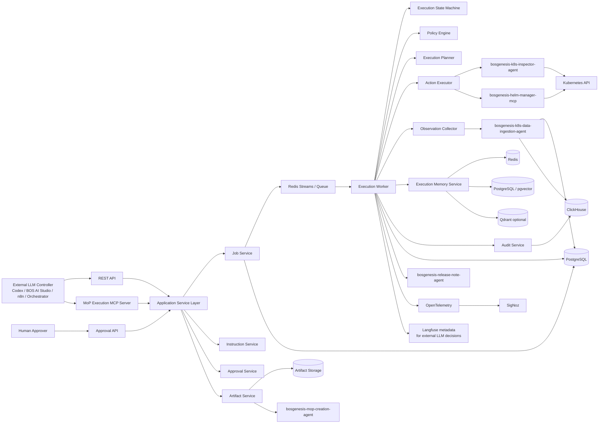
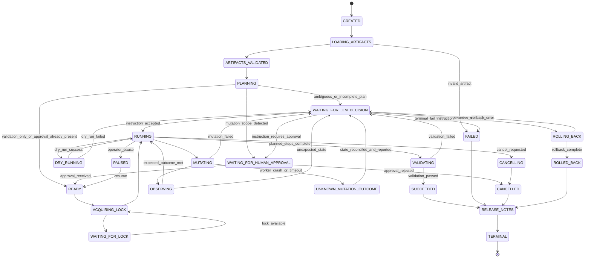
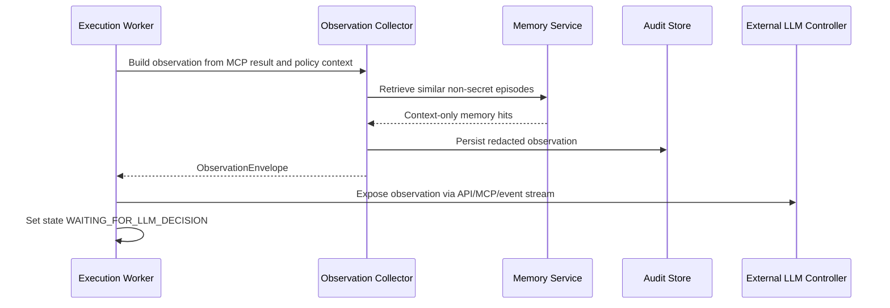
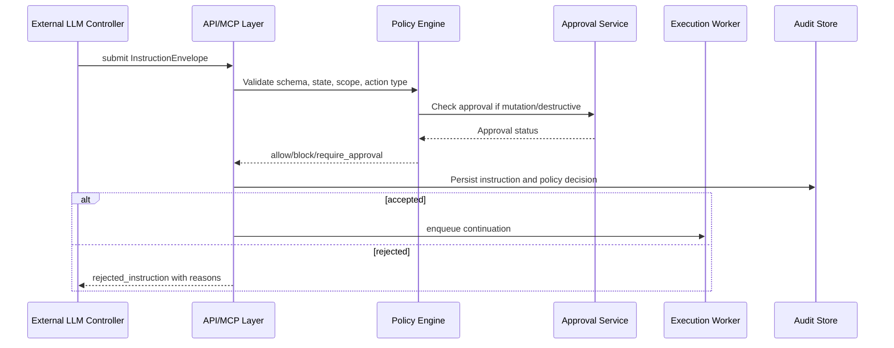

# BOS Genesis MoP Execution Agent - Low Level Design

**Document status:** Draft v0.1  
**Agent name:** `bosgenesis-mop-execution-agent`  
**Alternative name:** `bosgenesis-k8s-mop-installer-agent`  
**Python package:** `bosgenesis_mop_execution_agent`  
**Primary mode:** Async, long-running, externally controlled execution worker  
**Reasoning posture:** No autonomous reasoning authority  
**Execution posture:** Deterministic worker with strict mechanical guardrails  
**Primary input:** MoP Creation Agent output bundle  
**Primary output:** Audited installation execution, validation report, rollback report, and release/execution notes  
**Target platform:** Kubernetes namespace recreation using Kubernetes Inspector MCP and Helm Manager MCP  

---

## 1. Purpose

This document defines the low-level design for the `bosgenesis-mop-execution-agent`.

The agent installs or recreates Kubernetes and Helm resources into a target namespace by consuming artifacts produced by `bosgenesis-mop-creation-agent`, including:

- `machine_execution_plan.yaml`
- human-readable MoP Markdown
- machine-readable installation notes Markdown
- generated Kubernetes YAML manifests
- generated Helm values files
- `artifact.json`
- `artifact-index.json`
- `response.json`
- generated resource zip bundles

The execution agent is not a reasoning agent. It is a deterministic, policy-enforcing, async worker controlled by an external LLM or orchestration layer.

```text
The external LLM is the brain.
The MoP Execution Agent is the hands, memory, safety boundary, and audit trail.
```

The agent may run autonomously for long periods, but only as an executor of explicit plans and explicit external instructions. It pauses whenever reasoning, remediation, interpretation, or exception handling is required.

---

## 2. Hard Design Principles

### 2.1 No Autonomous Reasoning Authority

The worker must not independently decide how to repair, reinterpret, skip, retry, reorder, patch, or roll back a failed step.

The worker can enforce deterministic safety checks, but it cannot perform semantic remediation.

```yaml
reasoning_authority:
  worker_agent: false
  external_llm_controller: true
  human_approver: authorization_only
```

### 2.2 Memory Is Execution Memory Only

All layers of agentic memory exist, but only for continuity, recall, auditability, and external-LLM context.

```text
Memory is allowed to remember.
Memory is not allowed to decide.
```

Memory records must never be converted into actions without a fresh external LLM instruction and required human approval.

### 2.3 Brainless Does Not Mean Unsafe

The worker must be mechanical, not careless.

```text
“Brainless” does not mean unsafe.
The worker must not infer solutions, but it must enforce schema, scope,
approval, idempotency, redaction, concurrency locks, timeout limits,
and audit logging.
```

### 2.4 Human Approval Before Mutation

No mutating Kubernetes, Helm, application, or storage operation may run without a human approval record whose scope covers the requested action.

### 2.5 Dry-Run Before Mutation

Every Kubernetes apply/delete and Helm install/upgrade/uninstall/rollback must pass an applicable dry-run, simulation, or preview step before mutation, unless a future policy profile explicitly defines a controlled exception.

### 2.6 Namespace-Only v1 Scope

v1 is limited to one approved target namespace. Cluster-scoped resources, CRDs, StorageClasses, cluster RBAC, and multi-namespace changes are blocked unless a future policy profile explicitly enables them.

### 2.7 No Secret or Production Data Copying

The worker must never copy source Kubernetes Secret values or production data such as database rows, files, object data, Redis values, MongoDB documents, Kafka messages, ClickHouse data, PostgreSQL rows, or business payloads.

---

## 3. Low-Level Architecture



---

## 4. Runtime Units

| Runtime unit | Recommended deployment | Responsibility |
|---|---|---|
| API server | Kubernetes Deployment | REST API, MCP tools, auth, job creation, status, approvals, instructions, report retrieval. |
| Worker | Kubernetes Deployment | Executes async jobs from queue, drives deterministic state machine, calls MCP servers. |
| Reconciler | Kubernetes Deployment or worker sidecar | Rehydrates interrupted jobs, renews/reclaims locks, marks stale jobs as decision-required. |
| Queue | Redis Streams, Celery, Dramatiq, or equivalent | Durable dispatch of job work items and state transitions. |
| PostgreSQL | Managed DB or platform DB | Durable jobs, phases, steps, actions, approvals, instructions, lock records, memory metadata. |
| ClickHouse | Existing analytics store | High-volume audit events, observations, metrics, timeline analytics. |
| Redis | Existing Redis | Short-term state, active leases, namespace locks, event fanout. |
| Artifact storage | PVC, S3-compatible object store, or platform file store | Staged input bundles, output reports, redacted logs, rendered summaries. |
| OpenTelemetry collector | Platform collector | Trace/log/metric forwarding to SigNoz. |

---

## 5. Suggested Repository Structure

```text
bosgenesis-mop-execution-agent/
  README.md
  pyproject.toml
  Dockerfile
  .env.example
  config/
    settings.yaml
    policy.namespace-only-v1.yaml
    redaction.yaml
    state_machine.yaml
    mcp_capabilities.yaml
  src/
    bosgenesis_mop_execution_agent/
      __init__.py
      api/
        app.py
        dependencies.py
        routes_jobs.py
        routes_approvals.py
        routes_instructions.py
        routes_artifacts.py
        routes_health.py
        mcp_server.py
        schemas.py
      entrypoints/
        api_main.py
        worker_main.py
        reconciler_main.py
      config/
        settings.py
        policy_settings.py
        mcp_settings.py
      models/
        artifacts.py
        approvals.py
        audit.py
        errors.py
        execution.py
        instructions.py
        memory.py
        observations.py
        policies.py
        reports.py
        resources.py
        state.py
      core/
        application_service.py
        job_service.py
        worker.py
        reconciler.py
        state_machine.py
        scheduler.py
      artifacts/
        bundle_loader.py
        bundle_indexer.py
        checksum.py
        path_safety.py
        zip_loader.py
        mop_creation_client.py
      parsing/
        machine_plan_parser.py
        installation_notes_parser.py
        human_mop_parser.py
        yaml_manifest_parser.py
        helm_values_parser.py
        dependency_graph.py
      planning/
        execution_plan.py
        phase_queue.py
        action_mapper.py
        step_resolver.py
        dependency_validator.py
      policy/
        engine.py
        namespace_guard.py
        approval_guard.py
        dry_run_guard.py
        secret_guard.py
        production_data_guard.py
        cluster_scope_guard.py
        destructive_guard.py
        idempotency_guard.py
        instruction_guard.py
      execution/
        action_executor.py
        k8s_executor.py
        helm_executor.py
        validation_executor.py
        rollback_executor.py
        mcp_result_mapper.py
      mcp_clients/
        base.py
        k8s_inspector.py
        helm_manager.py
        data_ingestion.py
        mop_creation.py
        release_note.py
      observations/
        collector.py
        k8s_observer.py
        helm_observer.py
        event_collector.py
        log_collector.py
        diff_builder.py
        envelope_builder.py
      memory/
        service.py
        short_term_redis.py
        durable_postgres.py
        episodic_pgvector.py
        semantic_qdrant.py
        memory_policy.py
      persistence/
        postgres.py
        clickhouse.py
        redis.py
        artifact_store.py
        repositories.py
      audit/
        event_writer.py
        timeline.py
        immutable_log.py
      security/
        auth.py
        authorization.py
        redaction.py
        secret_detection.py
        signing.py
      observability/
        traces.py
        metrics.py
        logs.py
        langfuse_adapter.py
      reporting/
        report_renderer.py
        release_note_payload.py
        markdown_report.py
      common/
        ids.py
        time.py
        errors.py
        logging.py
        pagination.py
  migrations/
    postgres/
    clickhouse/
  tests/
    unit/
    contract/
    integration/
    failure_injection/
```

---

## 6. Module Responsibilities

### 6.1 API Layer

| Module | Responsibility |
|---|---|
| `api/app.py` | FastAPI application factory, middleware, auth setup, OpenTelemetry instrumentation. |
| `api/routes_jobs.py` | Create jobs, start jobs, get status, pause/resume/cancel, validation, rollback request. |
| `api/routes_approvals.py` | Human approval submission, approval listing, approval revocation when allowed. |
| `api/routes_instructions.py` | External LLM instruction submission, validation result retrieval, pending decisions. |
| `api/routes_artifacts.py` | Upload/stage bundles, list input/output artifacts, download reports and logs. |
| `api/mcp_server.py` | MCP tool exposure for Codex or external LLM tool use. |

### 6.2 Core Layer

| Module | Responsibility |
|---|---|
| `core/job_service.py` | Creates durable job records, creates phases/steps/actions, pushes queue events. |
| `core/worker.py` | Main async execution loop. Pulls jobs, transitions states, invokes policy and executor. |
| `core/reconciler.py` | Recovers interrupted jobs, stale locks, unknown mutation outcomes, and abandoned decisions. |
| `core/state_machine.py` | Strict state transition validation. No semantic interpretation. |
| `core/scheduler.py` | Queue dispatch, delayed wait actions, timeout timers. |

### 6.3 Artifact and Parsing Layer

| Module | Responsibility |
|---|---|
| `artifacts/bundle_loader.py` | Stages input bundle and validates required artifact inventory. |
| `artifacts/bundle_indexer.py` | Builds normalized file index and checksum map. |
| `parsing/machine_plan_parser.py` | Parses standalone `machine_execution_plan.yaml` into typed plan objects. |
| `parsing/installation_notes_parser.py` | Extracts embedded `machine_execution_plan` block when standalone YAML is absent. |
| `parsing/human_mop_parser.py` | Extracts explicit step order, titles, commands, validation text, and rollback text from MoP Markdown. |
| `parsing/yaml_manifest_parser.py` | Parses Kubernetes YAML documents and builds `ResourceRef` plus manifest digest. |
| `parsing/helm_values_parser.py` | Parses values files and validates redaction. |
| `parsing/dependency_graph.py` | Validates graph acyclicity and resolves phase dependencies. |

### 6.4 Planning Layer

| Module | Responsibility |
|---|---|
| `planning/execution_plan.py` | Internal typed plan generated from parsed artifacts. |
| `planning/phase_queue.py` | Topological sorting and phase/step queue generation. |
| `planning/action_mapper.py` | Maps plan commands to known MCP action types. |
| `planning/step_resolver.py` | Links MoP steps to YAML files and expected outcomes. |
| `planning/dependency_validator.py` | Ensures phase/step dependencies reference valid IDs. |

### 6.5 Policy Layer

| Module | Responsibility |
|---|---|
| `policy/engine.py` | Central deterministic allow/block/pause decision engine. |
| `policy/namespace_guard.py` | Enforces target namespace and source inspection constraints. |
| `policy/approval_guard.py` | Requires approval for mutation, destructive action, rollback, namespace creation, and exceptions. |
| `policy/dry_run_guard.py` | Enforces dry-run before mutation. |
| `policy/secret_guard.py` | Blocks raw Secret values and suspicious secret-like fields. |
| `policy/production_data_guard.py` | Blocks data payload copy operations. |
| `policy/cluster_scope_guard.py` | Blocks cluster-scoped resources in v1. |
| `policy/destructive_guard.py` | Blocks delete/force/replace/PVC deletion unless explicitly approved. |
| `policy/idempotency_guard.py` | Prevents duplicate unsafe mutation. |
| `policy/instruction_guard.py` | Validates external LLM instruction envelopes. |

### 6.6 Execution Layer

| Module | Responsibility |
|---|---|
| `execution/action_executor.py` | Dispatches typed actions to Kubernetes, Helm, validation, or rollback executor. |
| `execution/k8s_executor.py` | Calls Kubernetes Inspector MCP for dry-run apply, apply, get, describe, events, logs, rollout, delete. |
| `execution/helm_executor.py` | Calls Helm Manager MCP for repo, template, dry-run, install/upgrade, status, history, rollback, uninstall. |
| `execution/validation_executor.py` | Runs deterministic validation steps and records observations. |
| `execution/rollback_executor.py` | Runs approved rollback actions only when explicitly instructed. |
| `execution/mcp_result_mapper.py` | Normalizes MCP responses into action result objects. |

### 6.7 Observation Layer

| Module | Responsibility |
|---|---|
| `observations/collector.py` | Builds factual observation envelopes after every action or pause. |
| `observations/k8s_observer.py` | Reads resources, events, pod statuses, rollout status, and logs through K8s MCP. |
| `observations/helm_observer.py` | Reads Helm status, history, manifests, values, and failure info. |
| `observations/diff_builder.py` | Creates redacted desired-vs-observed diffs without deciding remediation. |
| `observations/envelope_builder.py` | Formats observations for external LLM and audit storage. |

### 6.8 Memory Layer

| Module | Responsibility |
|---|---|
| `memory/service.py` | Writes and retrieves execution memory records. |
| `memory/short_term_redis.py` | Stores active decision context and recent observations. |
| `memory/durable_postgres.py` | Stores durable job memory and replay checkpoints. |
| `memory/episodic_pgvector.py` | Stores non-secret prior execution outcomes and embeddings. |
| `memory/semantic_qdrant.py` | Optional semantic failure retrieval. |
| `memory/memory_policy.py` | Enforces `context_only_not_instruction` tagging. |

---

## 7. Execution Authority Matrix

| Decision or action | Worker | External LLM | Human approver |
|---|---:|---:|---:|
| Validate artifact schema | Yes | No | No |
| Parse YAML | Yes | No | No |
| Extract explicit plan steps | Yes | No | No |
| Infer missing plan steps | No | Yes | May approve |
| Dry-run a planned action | Yes, if policy allows | May instruct | Usually not required |
| Apply Kubernetes resource | Only after approval and valid plan | May instruct | Must approve |
| Install or upgrade Helm release | Only after approval and valid plan | May instruct | Must approve |
| Patch manifest semantics | No | May instruct | Must approve if mutating |
| Retry failed action | No, unless explicitly instructed or configured as bounded transport retry | Yes | If mutation involved |
| Skip failed action | No | Yes | Optional or required by policy |
| Roll back | Only after instruction and approval | Yes | Must approve |
| Delete PVC | No default | May instruct | Must explicitly approve destructive PVC action |
| Ignore error | No | Yes | Optional or required by policy |
| Use memory as guidance | Include as context only | Yes | Optional |
| Override namespace policy | No | No | No, unless future policy profile explicitly allows exception |
| Copy Secret values | No | No | No |
| Copy production data | No | No | No |

---

## 8. State Machine

### 8.1 Job States



### 8.2 State Transition Rules

| From state | To state | Required condition |
|---|---|---|
| `CREATED` | `LOADING_ARTIFACTS` | Job persisted and artifact reference present. |
| `LOADING_ARTIFACTS` | `ARTIFACTS_VALIDATED` | Bundle passes checksum, schema, and path-safety checks. |
| `PLANNING` | `WAITING_FOR_LLM_DECISION` | Missing or conflicting plan details. |
| `PLANNING` | `WAITING_FOR_HUMAN_APPROVAL` | Mutating actions exist and no approval is present. |
| `READY` | `ACQUIRING_LOCK` | Job is runnable and not paused/cancelled. |
| `ACQUIRING_LOCK` | `RUNNING` | Target namespace lock acquired. |
| `DRY_RUNNING` | `MUTATING` | Dry-run succeeded and approval covers mutation. |
| `MUTATING` | `OBSERVING` | MCP reports mutation request completed. |
| `OBSERVING` | `RUNNING` | Expected outcome observed. |
| Any non-terminal | `WAITING_FOR_LLM_DECISION` | Non-trivial error, ambiguity, unexpected state, or unknown outcome. |
| Any non-terminal | `CANCELLING` | Cancel requested and safe stop point reached. |
| `VALIDATING` | `SUCCEEDED` | Final validation passed. |
| Terminal pre-report | `RELEASE_NOTES` | Release-note integration enabled. |

---

## 9. Artifact Consumption Design

### 9.1 Supported Input Modes

| Input mode | Description |
|---|---|
| `mop_id` | Retrieve artifact bundle from `bosgenesis-mop-creation-agent`. |
| `artifact_bundle_zip` | Upload a zip containing generated artifacts. |
| `artifact_directory_ref` | Use a pre-mounted or object-storage path. |
| `standalone_files` | Provide MoP Markdown, installation notes, machine plan, and YAML files individually. |
| `generated_resource_zip` | Provide only generated manifests and require explicit external LLM instruction for sequencing if no plan exists. |

### 9.2 Artifact Priority

The loader resolves execution inputs in this order:

```text
1. Standalone machine_execution_plan.yaml
2. Embedded machine_execution_plan block in installation notes Markdown
3. Explicit commands and step order in human-readable MoP Markdown
4. Generated YAML and Helm values files
5. artifact.json / artifact-index.json / response.json metadata
6. PDF only for human review reference
```

The resource body is always loaded from YAML or Helm values files, not from prose text.

### 9.3 Sequence Resolution

The sequence resolver produces an internal `ExecutionPlan` using explicit sources only.

| Case | Worker behavior |
|---|---|
| Machine plan present and valid | Use machine plan phase/step order as canonical. |
| Machine plan missing, installation notes contain embedded plan | Use embedded plan and record lower input confidence. |
| Only MoP Markdown and YAML files present | Extract explicit step order and file references. Mark plan as `requires_external_llm_confirmation` before mutation. |
| YAML files present with no explicit order | Build inventory only. Enter `WAITING_FOR_LLM_DECISION` asking external LLM to provide an execution order. |
| Human MoP conflicts with machine plan | Enter `WAITING_FOR_LLM_DECISION` with conflict report. |
| YAML manifest missing for a referenced step | Enter `WAITING_FOR_LLM_DECISION` with missing file observation. |

### 9.4 Bundle Staging Layout

```text
/data/mop-execution/jobs/<job_id>/
  input/
    bundle.zip
    extracted/
      artifact.json
      artifact-index.json
      response.json
      machine_execution_plan.yaml
      human-readable-mop.md
      machine-readable-installation-notes.md
      generated/
        *.yaml
      values/
        *.yaml
  normalized/
    plan.normalized.yaml
    manifests.index.json
    values.index.json
  output/
    execution-report.md
    execution-report.json
    validation-report.json
    rollback-report.json
    release-note-request.json
    redacted-events.jsonl
```

### 9.5 Path Safety

The zip loader must block:

- absolute paths
- `../` traversal
- symlinks unless explicitly disabled at extraction
- device files
- files larger than configured limits
- unsupported binary payloads
- unexpected executable scripts

---

## 10. Core Data Models

The implementation should use Pydantic models or equivalent typed schemas. The examples below are logical schema sketches.

### 10.1 Execution Job

```yaml
ExecutionJob:
  job_id: string
  mop_id: string | null
  source_run_id: string | null
  correlation_id: string
  created_by: string
  controller_type: enum[codex,bos_ai_studio,n8n,api,system]
  source_namespace: string | null
  target_namespace: string
  artifact_bundle_ref: string
  artifact_bundle_digest: string | null
  policy_profile: string
  status: JobStatus
  current_phase_id: string | null
  current_step_id: string | null
  current_action_id: string | null
  current_observation_id: string | null
  awaiting_instruction: boolean
  awaiting_approval: boolean
  lock_key: string | null
  lock_acquired_at: datetime | null
  counters:
    phases_total: integer
    phases_completed: integer
    steps_total: integer
    steps_completed: integer
    actions_total: integer
    actions_completed: integer
    observations_total: integer
    retries_total: integer
    policy_blocks_total: integer
    errors_total: integer
  created_at: datetime
  updated_at: datetime
  terminal_at: datetime | null
  terminal_summary: object | null
```

### 10.2 Artifact Bundle

```yaml
ArtifactBundle:
  bundle_id: string
  job_id: string
  source_type: enum[mop_id,zip,directory,standalone_files]
  root_path: string
  files:
    - path: string
      role: enum[machine_plan,human_mop,installation_notes,manifest,values,artifact_json,artifact_index,response_json,zip,pdf,unknown]
      size_bytes: integer
      sha256: string
      parse_status: enum[pending,parsed,failed,skipped]
      parse_error: string | null
  validation_status: enum[pending,valid,invalid]
  warnings: list[string]
```

### 10.3 Machine Execution Plan

```yaml
MachineExecutionPlan:
  schema_version: string
  target_namespace: string
  authority_order: string | null
  executor_contract:
    parse_this_block_first: boolean
    dry_run_before_mutation: boolean
    human_approval_before_mutation: boolean
    never_copy_secret_values: boolean
    target_namespace_only: string | boolean
    llm_suggestions_are_not_authority: boolean | null
  dependency_graph:
    - phase_id: string
      depends_on: list[string]
  phases:
    - phase_id: string
      title: string | null
      objective: string
      depends_on: list[string]
      steps: list[MachinePlanStep]
```

### 10.4 Machine Plan Step

```yaml
MachinePlanStep:
  step_id: string
  phase_id: string
  title: string
  type: enum[context_check,k8s_apply,k8s_delete,k8s_get,k8s_validate,helm_install,helm_upgrade,helm_validate,wait,manual_input,rollback,release_notes,unknown]
  depends_on: list[string]
  evidence_refs: list[string]
  manifest_refs: list[string]
  values_refs: list[string]
  commands:
    - kind: string
      command: string
      dry_run: boolean | null
      mutating: boolean | null
  expected_outcomes: list[string]
  required_human_inputs: list[string]
  inference:
    label: enum[observed,deterministic,llm_suggestion,human_fill_in,unknown]
    confidence: enum[high,medium,low,unknown] | null
    rationale: string | null
```

### 10.5 Execution Phase / Step / Action

```yaml
ExecutionPhase:
  phase_id: string
  job_id: string
  sequence_index: integer
  status: PhaseStatus
  depends_on: list[string]
  started_at: datetime | null
  completed_at: datetime | null

ExecutionStep:
  step_id: string
  phase_id: string
  job_id: string
  sequence_index: integer
  source_ref: string
  action_ids: list[string]
  status: StepStatus
  attempts: integer
  last_observation_id: string | null

ExecutionAction:
  action_id: string
  job_id: string
  phase_id: string
  step_id: string
  action_type: ActionType
  mcp_target: enum[k8s_inspector,helm_manager,data_ingestion,mop_creation,release_note,none]
  resource_ref: ResourceRef | null
  manifest_ref: ManifestRef | null
  helm_ref: HelmReleaseRef | null
  dry_run_required: boolean
  approval_required: boolean
  destructive: boolean
  idempotency_key: string
  status: ActionStatus
  attempt: integer
  timeout_seconds: integer
```

### 10.6 Resource Reference

```yaml
ResourceRef:
  api_version: string
  group: string | null
  version: string
  kind: string
  name: string
  namespace: string | null
  scope: enum[namespaced,cluster,unknown]
  source_file: string | null
  desired_digest: string | null
```

### 10.7 Manifest Reference

```yaml
ManifestRef:
  manifest_id: string
  job_id: string
  path: string
  document_index: integer
  resource_ref: ResourceRef
  sha256_original: string
  sha256_effective: string
  namespace_rewritten: boolean
  redaction_status: enum[clean,redacted,blocked]
  parse_status: enum[parsed,failed]
```

### 10.8 Observation Envelope

```yaml
ObservationEnvelope:
  schema_version: "1.0"
  observation_id: string
  job_id: string
  correlation_id: string
  phase_id: string | null
  step_id: string | null
  action_id: string | null
  state: JobStatus
  target_namespace: string
  observation_type: enum[action_result,policy_block,decision_required,validation_result,approval_wait,lock_wait,terminal]
  action_attempted:
    action_type: string
    mcp_target: string | null
    resource_ref: ResourceRef | null
    command_redacted: string | null
    manifest_digest: string | null
  result:
    status: enum[succeeded,failed,blocked,skipped,timeout,unknown]
    exit_code: integer | null
    mcp_status_code: string | null
    stdout_redacted: string | null
    stderr_redacted: string | null
    error_code: string | null
    error_category: string | null
  observed_cluster_facts:
    existing_resource: boolean | null
    resource_snapshot_redacted: object | null
    events_redacted: list[object]
    related_pods: list[object]
    helm_status: object | null
  policy_context:
    dry_run_required: boolean
    dry_run_satisfied: boolean
    approval_required_for_mutation: boolean
    approval_present: boolean
    namespace_scope_valid: boolean
    destructive_action: boolean
    blocked_reasons: list[string]
  similar_past_episodes:
    authority: "context_only_not_instruction"
    records: list[MemoryHit]
  worker_request:
    decision_required: boolean
    requested_decision_type: list[string]
    allowed_instruction_types: list[string]
  created_at: datetime
```

### 10.9 External LLM Instruction Envelope

```yaml
InstructionEnvelope:
  schema_version: "1.0"
  instruction_id: string
  job_id: string
  correlation_id: string
  issued_by: string
  issued_by_type: enum[external_llm_controller,human_operator,system_test]
  based_on_observation_id: string
  intent: enum[continue,retry,wait,patch_manifest,skip_step,request_approval,rollback,fail_job,cancel_job,run_validation,regenerate_mop]
  target_phase_id: string | null
  target_step_id: string | null
  target_action_id: string | null
  action:
    type: string
    parameters: object
    dry_run_first: boolean
    mutate_after_dry_run: boolean
  constraints:
    target_namespace_only: boolean
    no_secret_values: boolean
    no_production_data: boolean
    require_human_approval_for_mutation: boolean
  expected_observation:
    success_criteria: list[string]
    timeout_seconds: integer | null
  approval_ref: string | null
  expires_at: datetime | null
  signature: string | null
```

### 10.10 Human Approval Envelope

```yaml
HumanApproval:
  approval_id: string
  job_id: string
  approver_id: string
  approver_display_name: string | null
  approval_type: enum[mutation,destructive,rollback,namespace_create,pvc_delete,secret_placeholder,policy_exception]
  scope:
    target_namespace: string
    phase_ids: list[string] | null
    step_ids: list[string] | null
    action_types: list[string]
    resource_refs: list[ResourceRef] | null
    allow_destructive: boolean
    allow_pvc_delete: boolean
    allow_namespace_delete: boolean
  ticket_ref: string | null
  reason: string
  expires_at: datetime
  status: enum[active,expired,revoked,rejected,consumed]
  created_at: datetime
```

---

## 11. REST API Design

### 11.1 Create Execution Job

```http
POST /execution-jobs
```

Request:

```json
{
  "correlation_id": "signoz-e2e-rbac-install-001",
  "source_namespace": "signoz",
  "target_namespace": "signoz-e2e-mirror-rbac",
  "artifact_bundle": {
    "type": "mop_id",
    "mop_id": "43dc9728-ed23-40e1-b062-fc3d05ae726b"
  },
  "policy_profile": "namespace_only_v1",
  "controller": {
    "type": "codex",
    "session_id": "external-session-123"
  },
  "start_immediately": false
}
```

Response:

```json
{
  "job_id": "exec-01HX...",
  "status": "CREATED",
  "target_namespace": "signoz-e2e-mirror-rbac",
  "next_required_action": "start_or_submit_approval",
  "links": {
    "self": "/execution-jobs/exec-01HX...",
    "events": "/execution-jobs/exec-01HX.../events",
    "approvals": "/execution-jobs/exec-01HX.../approvals",
    "instructions": "/execution-jobs/exec-01HX.../instructions"
  }
}
```

### 11.2 Start Job

```http
POST /execution-jobs/{job_id}/start
```

The start endpoint enqueues the job. It does not bypass approval requirements.

Response:

```json
{
  "job_id": "exec-01HX...",
  "status": "LOADING_ARTIFACTS",
  "queued": true
}
```

### 11.3 Get Job Status

```http
GET /execution-jobs/{job_id}
```

Response:

```json
{
  "job_id": "exec-01HX...",
  "status": "WAITING_FOR_LLM_DECISION",
  "current_phase_id": "apply_configmaps",
  "current_step_id": "apply-configmap-istio-ca-root-cert",
  "current_observation_id": "obs-01HX...",
  "awaiting_instruction": true,
  "awaiting_approval": false,
  "progress": {
    "phases_completed": 3,
    "phases_total": 10,
    "steps_completed": 14,
    "steps_total": 42
  }
}
```

### 11.4 Submit External LLM Instruction

```http
POST /execution-jobs/{job_id}/instructions
```

Request body is an `InstructionEnvelope`.

Response:

```json
{
  "instruction_id": "instr-01HX...",
  "accepted": true,
  "policy_decision": "allowed_after_dry_run",
  "approval_required": false,
  "job_status": "READY"
}
```

Rejected instruction response:

```json
{
  "instruction_id": "instr-01HX...",
  "accepted": false,
  "policy_decision": "blocked",
  "blocked_reasons": [
    "target_namespace_mismatch",
    "mutation_without_approval"
  ],
  "job_status": "WAITING_FOR_LLM_DECISION"
}
```

### 11.5 Submit Human Approval

```http
POST /execution-jobs/{job_id}/approvals
```

Request:

```json
{
  "approval_type": "mutation",
  "approver_id": "user@example.com",
  "scope": {
    "target_namespace": "signoz-e2e-mirror-rbac",
    "phase_ids": ["apply_configmaps", "apply_pvcs", "apply_raw_kubernetes_resources", "apply_ingress"],
    "action_types": ["k8s_apply", "helm_install", "helm_upgrade"],
    "allow_destructive": false,
    "allow_pvc_delete": false,
    "allow_namespace_delete": false
  },
  "ticket_ref": "CHG-123456",
  "reason": "Approved change window for namespace recreation",
  "expires_at": "2026-06-16T23:59:00Z"
}
```

Response:

```json
{
  "approval_id": "appr-01HX...",
  "status": "active",
  "scope_valid": true
}
```

### 11.6 Get Observations

```http
GET /execution-jobs/{job_id}/observations?limit=50&after=obs-...
```

Returns redacted observation envelopes suitable for external LLM reasoning.

### 11.7 Stream Events

```http
GET /execution-jobs/{job_id}/events/stream
```

Recommended formats:

- Server-Sent Events for UI and external controller integration
- paged JSON API for batch retrieval
- Redis pub/sub or stream for internal consumers

### 11.8 Pause, Resume, Cancel

```http
POST /execution-jobs/{job_id}/pause
POST /execution-jobs/{job_id}/resume
POST /execution-jobs/{job_id}/cancel
```

Cancel waits for a safe stop point. It does not interrupt an in-flight MCP mutation without recording unknown outcome handling.

### 11.9 Rollback

```http
POST /execution-jobs/{job_id}/rollback
```

A rollback request must include or reference:

- external LLM rollback instruction
- rollback scope
- human destructive approval if required
- PVC/data retention policy

### 11.10 Reports

```http
GET /execution-jobs/{job_id}/report
GET /execution-jobs/{job_id}/artifacts
GET /execution-jobs/{job_id}/artifacts/{artifact_id}/download
```

---

## 12. MCP Tool Design

The agent exposes MCP tools so an external LLM can control jobs without using raw HTTP.

### 12.1 Tool List

| Tool | Purpose |
|---|---|
| `create_mop_execution_job` | Create execution job from MoP artifact reference. |
| `start_mop_execution_job` | Start or enqueue the job. |
| `get_mop_execution_job` | Fetch current status. |
| `list_mop_execution_events` | Retrieve event timeline. |
| `get_mop_execution_observation` | Fetch a specific observation envelope. |
| `list_pending_mop_execution_decisions` | List jobs waiting for LLM instruction. |
| `submit_mop_execution_instruction` | Submit external LLM instruction envelope. |
| `submit_mop_execution_approval` | Submit human approval reference or approval envelope. |
| `pause_mop_execution_job` | Pause at next safe point. |
| `resume_mop_execution_job` | Resume a paused job. |
| `cancel_mop_execution_job` | Cancel at safe point. |
| `request_mop_execution_rollback` | Request rollback with instruction and approval references. |
| `validate_mop_execution_target` | Run validation-only pass. |
| `get_mop_execution_report` | Retrieve report metadata/content. |
| `get_mop_execution_config` | Safe config inspection. |
| `healthcheck_mop_execution_agent` | Liveness/readiness info. |

### 12.2 MCP Tool Safety

All MCP tools must:

- authenticate the caller
- write an audit event
- validate schema
- redact sensitive arguments before logs
- enforce current job state
- return deterministic status, not recommendations

---

## 13. External LLM Control Loop

### 13.1 Worker-to-LLM Observation Flow



The worker does not ask itself what to do. It emits a factual observation and waits.

### 13.2 LLM-to-Worker Instruction Flow



### 13.3 Allowed Instruction Intents

| Intent | Worker behavior |
|---|---|
| `continue` | Continue next planned action if no policy block exists. |
| `retry` | Retry a specific action only with explicit target and retry bounds. |
| `wait` | Schedule a delay or repeated observation without mutation. |
| `patch_manifest` | Apply a supplied patch to staged manifest, run dry-run, require approval before mutation. |
| `skip_step` | Mark step skipped with instruction citation and optional human approval. |
| `request_approval` | Move job to approval wait state. |
| `rollback` | Enter rollback flow if approval scope covers it. |
| `fail_job` | Mark job failed with supplied reason. |
| `cancel_job` | Cancel at safe point. |
| `run_validation` | Run validation-only actions. |
| `regenerate_mop` | Call MoP Creation Agent only if configured and explicitly instructed. |

---

## 14. Planning and Parsing Details

### 14.1 Plan Normalization Algorithm

```text
function normalize_plan(bundle, request):
    load and fingerprint bundle
    find standalone machine_execution_plan.yaml

    if machine_execution_plan.yaml exists:
        plan = parse_machine_plan(file)
        plan_source = "standalone_machine_plan"
    else if installation_notes has embedded machine_execution_plan:
        plan = parse_embedded_plan(markdown)
        plan_source = "installation_notes_embedded_plan"
    else:
        explicit_steps = parse_human_mop(markdown)
        yaml_index = parse_yaml_files(bundle)
        plan = build_explicit_only_plan(explicit_steps, yaml_index)
        plan.requires_external_llm_confirmation = true
        plan_source = "human_mop_explicit_extraction"

    validate target_namespace against request
    validate dependency graph is acyclic
    validate phases and steps have stable IDs
    map commands to supported action types
    link steps to manifest/values files
    validate every referenced file exists
    return normalized plan
```

### 14.2 Markdown Step Extraction

The Markdown extractor is not allowed to infer hidden steps. It can extract only explicit content:

- section headers
- numbered step titles
- fenced shell commands
- expected output blocks
- validation blocks
- rollback blocks
- file paths mentioned in command text
- target namespace text

If a required relation is implicit, the extractor records an ambiguity.

Example ambiguity:

```yaml
ambiguity:
  type: "step_to_manifest_mapping_missing"
  markdown_step: "Apply generated ConfigMaps"
  candidate_files:
    - "generated/configmap-istio-ca-root-cert.yaml"
    - "generated/configmap-kube-root-ca.crt.yaml"
  worker_action: "WAITING_FOR_LLM_DECISION"
```

### 14.3 YAML Manifest Parsing

The YAML parser must support:

- single-document YAML
- multi-document YAML
- Kubernetes lists when explicitly allowed
- comments and anchors where the parser supports them

The parser must reject or pause on:

- invalid YAML syntax
- unknown or missing `apiVersion`, `kind`, or `metadata.name`
- cluster-scoped resources in namespace-only v1
- manifests with a namespace different from target when rewrite is not explicitly allowed
- raw Secret values
- suspicious embedded credentials
- resources larger than configured size limits

### 14.4 Namespace Rewrite

Namespace rewrite is a mechanical operation, not reasoning, only when policy allows it.

```yaml
namespace_rewrite_policy:
  enabled: true
  allowed_when:
    - source_namespace_is_known
    - target_namespace_is_known
    - resource_is_namespaced
    - manifest_namespace_in_allowed_source_set
  blocked_when:
    - resource_is_cluster_scoped
    - manifest_contains_multiple_namespaces
    - manifest_namespace_is_unrelated_to_source_or_target
    - instruction_disallows_rewrite
```

All rewrites must be recorded as patches and included in the audit trail.

### 14.5 Runtime Metadata Handling

The worker should not need to normalize manifests generated by the MoP Creation Agent. If runtime-only fields are found, behavior is policy controlled.

Default v1 behavior:

| Field type | Default behavior |
|---|---|
| `metadata.resourceVersion` | Remove only if `allow_mechanical_runtime_field_cleanup=true`; otherwise pause. |
| `metadata.uid` | Remove only if allowed; otherwise pause. |
| `metadata.managedFields` | Remove only if allowed; otherwise pause. |
| `status` | Remove only if allowed; otherwise pause. |
| PVC bound volume fields | Pause unless plan explicitly generated safe PVC manifest. |
| Service cluster IP fields | Pause unless plan explicitly allows removal. |

---

## 15. Policy Engine Details

### 15.1 Policy Decision Output

```yaml
PolicyDecision:
  decision: enum[allow,block,pause,require_approval]
  action_id: string
  job_id: string
  reasons: list[string]
  required_approval_types: list[string]
  blocked_fields: list[string]
  redaction_count: integer
  dry_run_required: boolean
  dry_run_satisfied: boolean
  namespace_scope_valid: boolean
  idempotency_status: enum[new,duplicate_safe,duplicate_blocked,unknown]
```

### 15.2 Policy Evaluation Order

```text
1. Authenticate caller or worker context
2. Validate job state permits action
3. Validate instruction envelope if action came from external LLM
4. Validate target namespace scope
5. Validate resource scope
6. Validate no raw secrets or production data
7. Validate action type is allowed by policy profile
8. Validate dry-run precondition
9. Validate human approval for mutation/destructive action
10. Validate idempotency and lock ownership
11. Validate timeout/retry limits
12. Emit allow/block/pause/require_approval decision
```

### 15.3 Namespace Guard

Allowed v1 operations:

- read source namespace metadata when configured
- read approved target namespace
- create target namespace only when allowed and approved
- apply namespace-scoped target resources
- delete namespace-scoped target resources only under rollback/destructive approval

Blocked v1 operations:

- modify source namespace
- modify unrelated namespace
- modify cluster-scoped resources
- modify multiple target namespaces in one job

### 15.4 Secret Guard

Secret guard must evaluate:

- Kubernetes `Secret` resources
- environment variable names
- config keys with secret-like names
- base64-looking high-entropy values
- common token/password patterns
- connection strings with credentials
- private key markers

Default behavior:

| Finding | Behavior |
|---|---|
| Secret metadata with no data | Allow only if approved as placeholder. |
| Secret `data` or `stringData` values present | Block. |
| Secret-like key in ConfigMap | Redact in logs and pause if value appears sensitive. |
| TLS certificate public cert | Configurable; private key always blocked. |
| Password/token in command or instruction | Reject instruction and redact. |

### 15.5 Destructive Guard

The following are destructive by default:

- Kubernetes delete
- Helm uninstall
- Helm rollback if it changes current deployed revision
- force replace
- patch removing resources or selectors
- PVC deletion
- namespace deletion
- any action with data loss risk

Destructive actions require:

- explicit external LLM instruction
- explicit human approval with `allow_destructive=true`
- resource-specific scope
- dry-run or preview where supported
- rollback/reporting plan

---

## 16. Kubernetes Execution Design

### 16.1 Supported Kubernetes Action Types

| Action type | MCP operation | Mutating | Dry-run required |
|---|---|---:|---:|
| `k8s_get_namespace` | Get namespace | No | No |
| `k8s_create_namespace` | Create namespace | Yes | Yes, if supported |
| `k8s_server_side_dry_run_apply` | Server-side dry-run apply | No | N/A |
| `k8s_apply` | Apply resource | Yes | Yes |
| `k8s_get_resource` | Get resource | No | No |
| `k8s_describe_resource` | Describe resource | No | No |
| `k8s_list_events` | List events | No | No |
| `k8s_get_pod_logs` | Read logs | No | No |
| `k8s_rollout_status` | Check rollout | No | No |
| `k8s_delete_resource` | Delete resource | Yes/destructive | Yes/preview if supported |
| `k8s_wait_condition` | Wait/read condition | No | No |

### 16.2 Apply Pipeline

```text
function execute_k8s_apply(action):
    assert action.manifest_ref exists
    assert resource scope is namespaced
    assert resource namespace == target_namespace
    assert target namespace lock is held for mutation

    policy_pre_dry_run = policy.evaluate(action, stage="pre_dry_run")
    if blocked or pause: stop and emit observation

    dry_run_result = k8s_mcp.server_side_dry_run_apply(manifest)
    record observation
    if dry_run_result.failed:
        enter WAITING_FOR_LLM_DECISION
        return

    mark dry_run_satisfied(action)

    policy_pre_mutation = policy.evaluate(action, stage="pre_mutation")
    if approval_required: enter WAITING_FOR_HUMAN_APPROVAL
    if blocked or pause: stop and emit observation

    apply_result = k8s_mcp.apply(manifest)
    record observation
    if apply_result.unknown: enter UNKNOWN_MUTATION_OUTCOME
    if apply_result.failed: enter WAITING_FOR_LLM_DECISION

    observed = k8s_mcp.get_resource(resource_ref)
    validate expected outcome mechanically
    if expected outcome not met: enter WAITING_FOR_LLM_DECISION
    mark action complete
```

### 16.3 Existing Resource Handling

The worker may mechanically classify existing-resource cases:

| Case | Worker behavior |
|---|---|
| Resource exists and server-side dry-run succeeds | Continue to approval/mutation path. |
| Resource exists and desired digest matches observed normalized spec | Mark as `no_op_existing_match` if policy allows exact-match no-op. |
| Resource exists with immutable field conflict | Pause with diff and Kubernetes error. |
| Resource exists in another namespace | Block. |
| Resource exists but ownership/adoption is ambiguous | Pause for external LLM instruction. |
| Resource was not created by this job and destructive replace is requested | Require explicit destructive approval and instruction. |

### 16.4 PVC Handling

PVCs are data-bearing risk objects. v1 behavior:

- creating a new PVC in target namespace can be allowed with approval
- changing storage class, access mode, volume name, selector, or size downward pauses
- deleting a PVC is blocked unless destructive PVC-specific approval exists
- copying PV binding from source is blocked
- copying production volume data is blocked

### 16.5 Ingress Handling

Ingress actions require observation of:

- ingress class
- host/path conflicts
- TLS secret references without values
- service backend existence
- events after apply

Any host conflict or missing backend pauses for external LLM guidance.

---

## 17. Helm Execution Design

### 17.1 Supported Helm Action Types

| Action type | MCP operation | Mutating | Dry-run required |
|---|---|---:|---:|
| `helm_version` | Helm version | No | No |
| `helm_list` | List releases | No | No |
| `helm_repo_add` | Add repo | Local/config mutation | Yes/configurable |
| `helm_repo_update` | Update repo cache | Local/config mutation | Configurable |
| `helm_dependency_build` | Build dependencies | Local artifact mutation | Configurable |
| `helm_template` | Render chart | No | No |
| `helm_dry_run_install_upgrade` | Install/upgrade dry-run | No cluster mutation | N/A |
| `helm_install_upgrade` | Install or upgrade | Yes | Yes |
| `helm_status` | Status | No | No |
| `helm_history` | History | No | No |
| `helm_rollback` | Rollback | Yes/destructive | Preview if supported |
| `helm_uninstall` | Uninstall | Yes/destructive | Preview if supported |

### 17.2 Helm Pipeline

```text
function execute_helm_install_or_upgrade(action):
    validate release namespace == target_namespace
    validate chart source is public or pre-approved
    validate values file exists and is redacted
    validate no secret values in values

    render_result = helm_mcp.template(chart, values, namespace)
    if render_result.failed:
        enter WAITING_FOR_LLM_DECISION
        return

    dry_run_result = helm_mcp.dry_run_install_or_upgrade(release, chart, values, namespace)
    if dry_run_result.failed:
        enter WAITING_FOR_LLM_DECISION
        return

    policy_pre_mutation = policy.evaluate(action, stage="pre_mutation")
    if approval_required: enter WAITING_FOR_HUMAN_APPROVAL
    if blocked or pause: stop

    result = helm_mcp.install_or_upgrade(release, chart, values, namespace)
    if result.failed or result.unknown:
        observe helm status/history
        enter WAITING_FOR_LLM_DECISION
        return

    status = helm_mcp.status(release, namespace)
    if status not acceptable:
        enter WAITING_FOR_LLM_DECISION
    else:
        mark action complete
```

### 17.3 Helm Release Exists Handling

| Case | Worker behavior |
|---|---|
| Release exists and plan action is upgrade/install | Run Helm dry-run upgrade if action maps to upgrade/install. |
| Release exists but belongs to another expected owner | Pause. |
| Release name conflict in target namespace | Pause. |
| Helm history indicates failed previous release | Include status/history in observation and pause. |
| Chart render produces cluster-scoped resources | Block in namespace-only v1. |

---

## 18. Validation Executor

Validation is read-only unless explicitly instructed otherwise.

### 18.1 Validation Inputs

- expected resources from plan
- applied action records
- skipped action records
- Helm release list/status
- Kubernetes resource inventory
- events and pod statuses
- data ingestion snapshots for target namespace
- approved deviations

### 18.2 Validation Checks

| Check | Data source | Failure behavior |
|---|---|---|
| Target namespace exists | K8s Inspector MCP | Decision required. |
| Expected ConfigMaps exist | K8s Inspector MCP | Decision required. |
| Expected PVCs exist and safe status recorded | K8s Inspector MCP | Decision required if missing or problematic. |
| Helm releases deployed | Helm Manager MCP | Decision required. |
| Workloads ready | K8s Inspector MCP | Decision required with events/logs. |
| Ingress exists | K8s Inspector MCP | Decision required. |
| No out-of-scope namespace modifications | Audit + K8s snapshot | Policy violation if detected. |
| Secret values not logged/stored | Redaction counters + scans | Fail security gate. |
| Plan deviations approved | Job records | Decision required if unapproved. |

### 18.3 Validation Report Schema

```yaml
ValidationReport:
  report_id: string
  job_id: string
  status: enum[passed,failed,partial,skipped]
  generated_at: datetime
  checks:
    - check_id: string
      name: string
      status: enum[passed,failed,warning,skipped]
      resource_ref: ResourceRef | null
      details_redacted: object
      observation_id: string | null
  approved_deviations:
    - deviation_id: string
      instruction_id: string
      approval_id: string | null
      reason: string
  summary:
    total_checks: integer
    passed: integer
    failed: integer
    warnings: integer
    skipped: integer
```

---

## 19. Rollback Executor

Rollback is never automatic. It requires explicit external LLM instruction and human approval.

### 19.1 Rollback Scope Construction

The worker records for each resource:

```yaml
ResourceMutationRecord:
  resource_ref: ResourceRef
  action_id: string
  existed_before_job: boolean
  created_by_job: boolean
  previous_digest: string | null
  desired_digest: string
  mutation_result: enum[succeeded,failed,unknown]
  rollback_action_candidates:
    - type: enum[delete_created_resource,apply_previous_manifest,helm_rollback,helm_uninstall,retain]
      destructive: boolean
      approval_required: boolean
```

The worker may list candidates, but the external LLM chooses the rollback action.

### 19.2 PVC and Data Retention

Default rollback behavior must retain PVCs unless explicit PVC deletion approval is present.

```yaml
rollback_data_policy:
  retain_pvcs_by_default: true
  delete_pvc_requires:
    - explicit_external_llm_instruction
    - human_approval_type_pvc_delete
    - resource_specific_scope
  never_delete_source_data: true
```

### 19.3 Rollback Report

The rollback report includes:

- rollback instruction ID
- approval IDs
- resources rolled back
- resources retained
- PVC/data retention decisions
- failures and observations
- final validation state

---

## 20. Observation and Error Handling

### 20.1 Error Taxonomy

| Error code | Category | Typical source | Default worker behavior |
|---|---|---|---|
| `ARTIFACT_MISSING` | artifact | bundle loader | Pause decision required. |
| `ARTIFACT_CHECKSUM_MISMATCH` | artifact | bundle loader | Block. |
| `MACHINE_PLAN_PARSE_ERROR` | schema | plan parser | Pause decision required. |
| `YAML_PARSE_ERROR` | schema | YAML parser | Pause decision required. |
| `MANIFEST_NAMESPACE_MISMATCH` | policy | namespace guard | Block or pause if rewrite may be instructed. |
| `CLUSTER_SCOPED_RESOURCE_BLOCKED` | policy | cluster scope guard | Block. |
| `SECRET_VALUE_BLOCKED` | security | secret guard | Block. |
| `PRODUCTION_DATA_BLOCKED` | security | production data guard | Block. |
| `APPROVAL_REQUIRED` | approval | approval guard | Wait for approval. |
| `APPROVAL_SCOPE_MISMATCH` | approval | approval guard | Pause. |
| `DRY_RUN_FAILED` | Kubernetes/Helm | MCP result | Pause decision required. |
| `K8S_FORBIDDEN` | RBAC | Kubernetes API | Pause decision required. |
| `K8S_ALREADY_EXISTS` | conflict | Kubernetes API | Pause unless exact no-op. |
| `K8S_IMMUTABLE_FIELD` | conflict | Kubernetes API | Pause. |
| `PVC_PENDING` | storage | Kubernetes events | Pause. |
| `NODE_NOT_READY` | scheduling | Kubernetes events | Pause. |
| `POD_UNSCHEDULABLE` | scheduling | Kubernetes events | Pause. |
| `POD_CRASH_LOOP` | workload | Kubernetes status/logs | Pause. |
| `ROLLOUT_TIMEOUT` | workload | rollout status | Pause. |
| `INGRESS_CONFLICT` | networking | ingress/events | Pause. |
| `HELM_RENDER_FAILED` | Helm | helm template | Pause. |
| `HELM_RELEASE_EXISTS` | Helm | helm status | Pause unless plan explicitly upgrade/install. |
| `HELM_INSTALL_FAILED` | Helm | helm install | Pause. |
| `MCP_UNAVAILABLE` | infrastructure | MCP client | Pause or bounded transport retry. |
| `ACTION_TIMEOUT` | timeout | executor | Pause. |
| `UNKNOWN_MUTATION_OUTCOME` | recovery | crash/timeout | Pause after observation. |
| `VALIDATION_MISMATCH` | validation | validation executor | Pause. |

### 20.2 Decision Required Envelope

Every non-trivial error results in:

```yaml
decision_required:
  job_id: string
  observation_id: string
  error_code: string
  error_category: string
  failed_phase_id: string
  failed_step_id: string
  failed_action_id: string
  facts_redacted:
    command: string | null
    mcp_response: object
    stderr: string | null
    events: list[object]
    logs_excerpt: string | null
    desired_vs_observed_diff: object | null
  policy_context: object
  memory_context:
    authority: context_only_not_instruction
    records: list[object]
  allowed_instruction_types:
    - retry
    - wait
    - patch_manifest
    - skip_step
    - rollback
    - fail_job
```

### 20.3 Transport Retry Policy

The only automatic retries allowed are bounded transport retries for clearly non-mutating calls or idempotent reads.

```yaml
transport_retry_policy:
  read_operations:
    enabled: true
    max_attempts: 3
    backoff: exponential
  dry_run_operations:
    enabled: true
    max_attempts: 2
    retry_on:
      - mcp_timeout
      - transient_connection_error
  mutating_operations:
    enabled: false
    requires_external_instruction: true
```

---

## 21. Memory Implementation

### 21.1 Memory Layers

```yaml
execution_memory_layers:
  in_run_state_memory:
    storage: process_memory
    authority: current_execution_state
    reasoning_allowed: false

  durable_job_memory:
    storage: postgresql
    authority: current_execution_state
    reasoning_allowed: false

  short_term_session_memory:
    storage: redis
    authority: active_context_only
    reasoning_allowed: false

  resource_state_memory:
    storage: postgresql_clickhouse
    authority: observed_cluster_facts
    reasoning_allowed: false

  episodic_execution_memory:
    storage: postgresql_pgvector
    authority: historical_context_only
    reasoning_allowed: false

  semantic_failure_memory:
    storage: qdrant_or_pgvector
    authority: prior_guidance_only
    reasoning_allowed: false

  policy_memory:
    storage: config_postgresql
    authority: enforced_policy
    reasoning_allowed: false

  approval_memory:
    storage: postgresql_append_only
    authority: human_authorization_record
    reasoning_allowed: false

  audit_memory:
    storage: clickhouse_or_postgresql_append_only
    authority: audit_record
    reasoning_allowed: false

  observability_memory:
    storage: signoz_opentelemetry_langfuse
    authority: operational_telemetry
    reasoning_allowed: false
```

### 21.2 Memory Write Rules

The worker may write:

- non-secret execution summaries
- error code and category
- redacted command/MCP result digests
- external LLM instruction metadata
- human approval metadata
- final outcome and validation results
- resource references and digests
- remediation outcome only after it was externally instructed

The worker must not write:

- raw Secret values
- production data
- unredacted logs containing credentials
- kubeconfigs
- raw private keys
- unbounded stdout/stderr
- direct instructions extracted from memory as executable commands

### 21.3 Memory Retrieval Rules

```text
function retrieve_memory_for_observation(error_context):
    build redacted query from error_code, kind, api_version, mcp_error, phase_id
    retrieve similar episodes from pgvector/qdrant
    filter records with redaction_status == non_secret_summary_only
    tag all records authority=context_only_not_instruction
    attach max N concise records to observation
    never alter job state based on retrieved records
```

---

## 22. Persistence Design

### 22.1 PostgreSQL Tables

#### `mop_execution_jobs`

```sql
CREATE TABLE mop_execution_jobs (
  job_id TEXT PRIMARY KEY,
  mop_id TEXT NULL,
  source_run_id TEXT NULL,
  correlation_id TEXT NOT NULL,
  source_namespace TEXT NULL,
  target_namespace TEXT NOT NULL,
  artifact_bundle_ref TEXT NOT NULL,
  artifact_bundle_digest TEXT NULL,
  policy_profile TEXT NOT NULL,
  status TEXT NOT NULL,
  current_phase_id TEXT NULL,
  current_step_id TEXT NULL,
  current_action_id TEXT NULL,
  current_observation_id TEXT NULL,
  awaiting_instruction BOOLEAN NOT NULL DEFAULT FALSE,
  awaiting_approval BOOLEAN NOT NULL DEFAULT FALSE,
  created_by TEXT NOT NULL,
  controller_type TEXT NOT NULL,
  counters JSONB NOT NULL DEFAULT '{}'::jsonb,
  terminal_summary JSONB NULL,
  created_at TIMESTAMPTZ NOT NULL,
  updated_at TIMESTAMPTZ NOT NULL,
  terminal_at TIMESTAMPTZ NULL
);
```

#### `mop_execution_phases`

```sql
CREATE TABLE mop_execution_phases (
  phase_pk BIGSERIAL PRIMARY KEY,
  job_id TEXT NOT NULL REFERENCES mop_execution_jobs(job_id),
  phase_id TEXT NOT NULL,
  sequence_index INTEGER NOT NULL,
  title TEXT NULL,
  depends_on JSONB NOT NULL DEFAULT '[]'::jsonb,
  status TEXT NOT NULL,
  started_at TIMESTAMPTZ NULL,
  completed_at TIMESTAMPTZ NULL,
  UNIQUE(job_id, phase_id)
);
```

#### `mop_execution_steps`

```sql
CREATE TABLE mop_execution_steps (
  step_pk BIGSERIAL PRIMARY KEY,
  job_id TEXT NOT NULL REFERENCES mop_execution_jobs(job_id),
  phase_id TEXT NOT NULL,
  step_id TEXT NOT NULL,
  sequence_index INTEGER NOT NULL,
  title TEXT NULL,
  source_ref TEXT NULL,
  status TEXT NOT NULL,
  attempts INTEGER NOT NULL DEFAULT 0,
  last_observation_id TEXT NULL,
  started_at TIMESTAMPTZ NULL,
  completed_at TIMESTAMPTZ NULL,
  UNIQUE(job_id, step_id)
);
```

#### `mop_execution_actions`

```sql
CREATE TABLE mop_execution_actions (
  action_id TEXT PRIMARY KEY,
  job_id TEXT NOT NULL REFERENCES mop_execution_jobs(job_id),
  phase_id TEXT NOT NULL,
  step_id TEXT NOT NULL,
  action_type TEXT NOT NULL,
  mcp_target TEXT NULL,
  resource_ref JSONB NULL,
  manifest_ref JSONB NULL,
  helm_ref JSONB NULL,
  dry_run_required BOOLEAN NOT NULL,
  dry_run_satisfied BOOLEAN NOT NULL DEFAULT FALSE,
  approval_required BOOLEAN NOT NULL,
  approval_id TEXT NULL,
  destructive BOOLEAN NOT NULL DEFAULT FALSE,
  idempotency_key TEXT NOT NULL,
  status TEXT NOT NULL,
  attempt INTEGER NOT NULL DEFAULT 0,
  timeout_seconds INTEGER NOT NULL,
  created_at TIMESTAMPTZ NOT NULL,
  updated_at TIMESTAMPTZ NOT NULL,
  UNIQUE(job_id, idempotency_key)
);
```

#### `mop_execution_observations`

```sql
CREATE TABLE mop_execution_observations (
  observation_id TEXT PRIMARY KEY,
  job_id TEXT NOT NULL REFERENCES mop_execution_jobs(job_id),
  phase_id TEXT NULL,
  step_id TEXT NULL,
  action_id TEXT NULL,
  observation_type TEXT NOT NULL,
  error_code TEXT NULL,
  error_category TEXT NULL,
  payload_redacted JSONB NOT NULL,
  created_at TIMESTAMPTZ NOT NULL
);
```

#### `mop_execution_instructions`

```sql
CREATE TABLE mop_execution_instructions (
  instruction_id TEXT PRIMARY KEY,
  job_id TEXT NOT NULL REFERENCES mop_execution_jobs(job_id),
  based_on_observation_id TEXT NOT NULL,
  issued_by TEXT NOT NULL,
  issued_by_type TEXT NOT NULL,
  intent TEXT NOT NULL,
  payload_redacted JSONB NOT NULL,
  validation_status TEXT NOT NULL,
  policy_decision TEXT NOT NULL,
  blocked_reasons JSONB NOT NULL DEFAULT '[]'::jsonb,
  approval_id TEXT NULL,
  created_at TIMESTAMPTZ NOT NULL,
  expires_at TIMESTAMPTZ NULL
);
```

#### `mop_execution_approvals`

```sql
CREATE TABLE mop_execution_approvals (
  approval_id TEXT PRIMARY KEY,
  job_id TEXT NOT NULL REFERENCES mop_execution_jobs(job_id),
  approver_id TEXT NOT NULL,
  approval_type TEXT NOT NULL,
  scope JSONB NOT NULL,
  ticket_ref TEXT NULL,
  reason TEXT NOT NULL,
  status TEXT NOT NULL,
  created_at TIMESTAMPTZ NOT NULL,
  expires_at TIMESTAMPTZ NOT NULL,
  revoked_at TIMESTAMPTZ NULL
);
```

#### `mop_execution_resource_mutations`

```sql
CREATE TABLE mop_execution_resource_mutations (
  mutation_id TEXT PRIMARY KEY,
  job_id TEXT NOT NULL REFERENCES mop_execution_jobs(job_id),
  action_id TEXT NOT NULL,
  resource_ref JSONB NOT NULL,
  existed_before_job BOOLEAN NOT NULL,
  created_by_job BOOLEAN NOT NULL,
  previous_digest TEXT NULL,
  desired_digest TEXT NULL,
  observed_digest_after TEXT NULL,
  mutation_result TEXT NOT NULL,
  rollback_candidates JSONB NOT NULL DEFAULT '[]'::jsonb,
  created_at TIMESTAMPTZ NOT NULL
);
```

### 22.2 ClickHouse Event Table

```sql
CREATE TABLE mop_execution_audit_events (
  event_time DateTime64(3),
  job_id String,
  correlation_id String,
  event_id String,
  event_type LowCardinality(String),
  phase_id String,
  step_id String,
  action_id String,
  status LowCardinality(String),
  error_code String,
  target_namespace String,
  mcp_target String,
  duration_ms UInt64,
  payload_redacted String
)
ENGINE = MergeTree
PARTITION BY toDate(event_time)
ORDER BY (job_id, event_time, event_id);
```

### 22.3 Redis Keys

| Key pattern | Purpose |
|---|---|
| `mop-exec:queue` | Worker job queue. |
| `mop-exec:job:{job_id}:state` | Short-term state cache. |
| `mop-exec:job:{job_id}:events` | Event fanout stream. |
| `mop-exec:lock:namespace:{target_namespace}` | Exclusive namespace mutation lock. |
| `mop-exec:decision:{job_id}` | Pending external LLM decision marker. |
| `mop-exec:approval-wait:{job_id}` | Pending approval marker. |

---

## 23. Idempotency and Locking

### 23.1 Namespace Lock

```yaml
NamespaceLock:
  lock_key: "mop-exec:lock:namespace:<target_namespace>"
  owner_job_id: string
  lease_seconds: 300
  renewal_interval_seconds: 60
  mode: exclusive_mutation
  released_on:
    - SUCCEEDED
    - FAILED
    - CANCELLED
    - ROLLED_BACK
```

Only one mutating job may hold a target namespace lock.

### 23.2 Action Idempotency Key

```text
idempotency_key = sha256(
  job_id + phase_id + step_id + action_type + target_namespace + resource_ref + desired_digest + instruction_id
)
```

For planned first-pass actions without an external instruction, `instruction_id` is `plan:<plan_digest>`.

### 23.3 Unknown Outcome Handling

If an action might have mutated the cluster and the worker lost contact:

```text
1. Stop the job.
2. Re-read the target resource or Helm release.
3. Compare observed digest/status with expected digest/status.
4. Persist observation with outcome=unknown or inferred_observed_state.
5. Enter WAITING_FOR_LLM_DECISION.
6. Never blindly retry mutation.
```

---

## 24. MCP Client Contracts

### 24.1 Common MCP Client Wrapper

All MCP client calls should return a normalized result:

```yaml
MCPCallResult:
  call_id: string
  mcp_target: string
  tool_name: string
  request_digest: string
  status: enum[succeeded,failed,timeout,unavailable,unknown]
  started_at: datetime
  ended_at: datetime
  duration_ms: integer
  stdout_redacted: string | null
  stderr_redacted: string | null
  payload_redacted: object | null
  error_code: string | null
  retryable_transport_error: boolean
```

### 24.2 Kubernetes Inspector Client Methods

Expected adapter methods:

```python
class K8sInspectorClient:
    async def get_namespace(self, name: str) -> MCPCallResult: ...
    async def create_namespace_dry_run(self, name: str) -> MCPCallResult: ...
    async def create_namespace(self, name: str) -> MCPCallResult: ...
    async def server_side_dry_run_apply(self, manifest: dict, namespace: str) -> MCPCallResult: ...
    async def apply(self, manifest: dict, namespace: str) -> MCPCallResult: ...
    async def get_resource(self, ref: ResourceRef) -> MCPCallResult: ...
    async def describe_resource(self, ref: ResourceRef) -> MCPCallResult: ...
    async def list_events(self, namespace: str, involved_ref: ResourceRef | None = None) -> MCPCallResult: ...
    async def get_pod_logs(self, namespace: str, selector: dict | None, pod_name: str | None) -> MCPCallResult: ...
    async def rollout_status(self, ref: ResourceRef, timeout_seconds: int) -> MCPCallResult: ...
    async def delete_resource_dry_run(self, ref: ResourceRef) -> MCPCallResult: ...
    async def delete_resource(self, ref: ResourceRef) -> MCPCallResult: ...
```

### 24.3 Helm Manager Client Methods

```python
class HelmManagerClient:
    async def version(self) -> MCPCallResult: ...
    async def list_releases(self, namespace: str) -> MCPCallResult: ...
    async def repo_add(self, name: str, url: str) -> MCPCallResult: ...
    async def repo_update(self) -> MCPCallResult: ...
    async def template(self, release: str, chart: str, namespace: str, values_path: str | None) -> MCPCallResult: ...
    async def dry_run_install_upgrade(self, release: str, chart: str, namespace: str, values_path: str | None) -> MCPCallResult: ...
    async def install_upgrade(self, release: str, chart: str, namespace: str, values_path: str | None) -> MCPCallResult: ...
    async def status(self, release: str, namespace: str) -> MCPCallResult: ...
    async def history(self, release: str, namespace: str) -> MCPCallResult: ...
    async def rollback(self, release: str, namespace: str, revision: int) -> MCPCallResult: ...
    async def uninstall(self, release: str, namespace: str, keep_history: bool) -> MCPCallResult: ...
```

### 24.4 Data Ingestion Client Methods

```python
class DataIngestionClient:
    async def get_latest_namespace_inventory(self, namespace: str) -> MCPCallResult: ...
    async def compare_namespace_inventory(self, namespace: str, expected_refs: list[ResourceRef]) -> MCPCallResult: ...
    async def get_recent_namespace_events(self, namespace: str, since_minutes: int) -> MCPCallResult: ...
```

### 24.5 MoP Creation Client Methods

```python
class MopCreationClient:
    async def get_artifact_index(self, mop_id: str) -> MCPCallResult: ...
    async def download_artifact_bundle(self, mop_id: str) -> MCPCallResult: ...
    async def preview_artifact(self, mop_id: str, path: str) -> MCPCallResult: ...
```

### 24.6 Release Note Client Methods

```python
class ReleaseNoteClient:
    async def create_execution_notes(self, payload: dict) -> MCPCallResult: ...
```

---

## 25. Observability Design

### 25.1 Trace Structure

```text
trace: mop_execution_job
  span: load_artifacts
  span: parse_plan
  span: validate_policy
  span: acquire_namespace_lock
  span: phase.<phase_id>
    span: step.<step_id>
      span: action.<action_id>.dry_run
      span: action.<action_id>.mutation
      span: action.<action_id>.observe
  span: validation
  span: release_notes
```

### 25.2 Required Span Attributes

- `job_id`
- `mop_id`
- `run_id`
- `correlation_id`
- `source_namespace`
- `target_namespace`
- `phase_id`
- `step_id`
- `action_id`
- `action_type`
- `mcp_target`
- `resource_kind`
- `resource_name`
- `resource_namespace`
- `dry_run_required`
- `approval_required`
- `approval_id`
- `error_code`
- `policy_decision`

### 25.3 Metrics

| Metric | Type | Labels |
|---|---|---|
| `mop_execution_jobs_total` | counter | status, policy_profile |
| `mop_execution_job_duration_seconds` | histogram | status, target_namespace |
| `mop_execution_phase_duration_seconds` | histogram | phase_id, status |
| `mop_execution_mcp_call_duration_seconds` | histogram | mcp_target, tool_name, status |
| `mop_execution_policy_blocks_total` | counter | reason, action_type |
| `mop_execution_decision_required_total` | counter | error_code, phase_id |
| `mop_execution_approval_wait_seconds` | histogram | approval_type |
| `mop_execution_llm_wait_seconds` | histogram | decision_type |
| `mop_execution_redactions_total` | counter | redaction_type |
| `mop_execution_namespace_lock_wait_seconds` | histogram | target_namespace |
| `mop_execution_unknown_outcomes_total` | counter | action_type |

### 25.4 Langfuse Usage

The execution agent has no internal LLM, but it can record metadata for external LLM decisions:

- observation ID sent to external LLM
- redacted context digest
- instruction ID returned
- instruction validation result
- policy decision
- approval reference

Do not store raw unredacted prompts or secrets.

---

## 26. Security Design

### 26.1 Authentication

Supported options:

- mTLS between platform services
- signed service tokens
- OAuth2/OIDC for human operators
- MCP caller identity binding
- signed instruction envelopes for external LLM controllers

### 26.2 Authorization Roles

| Role | Capabilities |
|---|---|
| `mop_exec.viewer` | Read job status, observations, redacted events, reports. |
| `mop_exec.controller` | Create jobs, submit external LLM instructions, pause/resume validation jobs. |
| `mop_exec.operator` | Start jobs, cancel jobs, run validation. |
| `mop_exec.approver` | Submit mutation approvals within allowed namespace scope. |
| `mop_exec.destructive_approver` | Approve rollback/destructive actions such as uninstall/delete. |
| `mop_exec.admin` | Manage policy profiles, retention, cleanup, service configuration. |

### 26.3 Kubernetes RBAC

Recommended v1 service account permissions:

- read target namespace
- create target namespace only if enabled
- get/list/watch namespace-scoped resources in target namespace
- create/update/patch namespace-scoped resources in target namespace
- delete namespace-scoped resources only if rollback/destructive execution is enabled
- get/list events and pod logs in target namespace
- Helm operations scoped to target namespace through Helm Manager MCP

Avoid:

- cluster-admin
- source namespace write
- Secret value read from source namespace
- CRD or StorageClass mutation
- cluster RBAC mutation

### 26.4 Redaction Pipeline

Redaction runs at every boundary:

```text
input artifact scan
  -> parsed object scan
  -> MCP request log redaction
  -> MCP response redaction
  -> observation envelope redaction
  -> memory write redaction
  -> audit write redaction
  -> external LLM context redaction
  -> release notes payload redaction
```

### 26.5 Redaction Patterns

At minimum:

- Kubernetes Secret `data` and `stringData`
- `password`, `passwd`, `pwd`
- `token`, `api_key`, `apikey`, `secret`, `client_secret`
- `authorization`, `cookie`, `set-cookie`
- private key blocks
- kubeconfig user tokens/certs/keys
- connection strings with credentials
- high-entropy values where configured

---

## 27. Configuration

### 27.1 Example `settings.yaml`

```yaml
agent:
  name: bosgenesis-mop-execution-agent
  environment: dev
  api_base_path: /api/v1
  reasoning_authority: external_llm_only

execution:
  queue_backend: redis_streams
  max_job_duration_minutes: 240
  max_phase_duration_minutes: 60
  max_step_duration_minutes: 30
  max_mcp_call_duration_seconds: 120
  decision_wait_timeout_minutes: 1440
  lock_lease_seconds: 300
  lock_renew_interval_seconds: 60
  start_jobs_paused_until_approval: true

artifacts:
  storage_backend: local
  root_path: /data/mop-execution
  max_bundle_size_mb: 200
  max_file_size_mb: 25
  allow_zip_upload: true
  allow_directory_ref: true
  reject_symlinks: true

policy:
  profile: namespace_only_v1
  require_dry_run_before_mutation: true
  require_human_approval_before_mutation: true
  target_namespace_only: true
  allow_namespace_create: false
  allow_cluster_scoped_resources: false
  allow_crd_mutation: false
  allow_storage_class_mutation: false
  allow_secret_value_copy: false
  allow_production_data_copy: false
  allow_pvc_delete: false
  allow_force_apply: false
  allow_mechanical_runtime_field_cleanup: false
  allow_namespace_rewrite: true

mcp:
  k8s_inspector:
    enabled: true
    endpoint: ${K8S_INSPECTOR_MCP_ENDPOINT}
    timeout_seconds: 120
  helm_manager:
    enabled: true
    endpoint: ${HELM_MANAGER_MCP_ENDPOINT}
    timeout_seconds: 180
  data_ingestion:
    enabled: true
    endpoint: ${K8S_DATA_INGESTION_MCP_ENDPOINT}
    timeout_seconds: 120
  mop_creation:
    enabled: true
    endpoint: ${MOP_CREATION_AGENT_ENDPOINT}
    timeout_seconds: 120
  release_note:
    enabled: true
    endpoint: ${RELEASE_NOTE_AGENT_ENDPOINT}
    timeout_seconds: 120

memory:
  enabled: true
  memory_can_decide: false
  redis_short_term_enabled: true
  postgres_durable_enabled: true
  pgvector_episodic_enabled: true
  qdrant_semantic_failure_enabled: true
  max_memory_hits_per_observation: 5
  min_memory_redaction_status: non_secret_summary_only

observability:
  otel_enabled: true
  signoz_enabled: true
  langfuse_enabled: true
  structured_logs_enabled: true

security:
  auth_enabled: true
  require_signed_instructions: false
  redact_before_persist: true
  redact_before_external_llm: true
  secret_detection_enabled: true
```

### 27.2 Environment Variables

```text
DATABASE_URL=postgresql://...
CLICKHOUSE_DSN=...
REDIS_URL=redis://...
QDRANT_URL=http://...
OTEL_EXPORTER_OTLP_ENDPOINT=http://...
SIGNOZ_ENDPOINT=http://...
LANGFUSE_HOST=http://...
K8S_INSPECTOR_MCP_ENDPOINT=http://...
HELM_MANAGER_MCP_ENDPOINT=http://...
K8S_DATA_INGESTION_MCP_ENDPOINT=http://...
MOP_CREATION_AGENT_ENDPOINT=http://...
RELEASE_NOTE_AGENT_ENDPOINT=http://...
ARTIFACT_ROOT_PATH=/data/mop-execution
```

---

## 28. Worker Algorithms

### 28.1 Main Worker Loop

```text
while worker is running:
    work_item = queue.pop()
    job = repository.get_job(work_item.job_id)

    if job.status is terminal:
        continue

    with trace(job):
        try:
            state_machine.assert_transition_allowed(job.status, work_item.intent)
            route_by_status(job)
        except PolicyBlocked as e:
            persist_policy_block_observation(e)
            set_job_waiting_for_llm_decision_if_recoverable_else_failed(e)
        except ApprovalRequired as e:
            persist_approval_wait_observation(e)
            set_job_waiting_for_human_approval(e)
        except Exception as e:
            persist_redacted_unhandled_error(e)
            set_job_waiting_for_llm_decision(e)
```

### 28.2 Route by Status

```text
function route_by_status(job):
    if job.status == CREATED:
        transition_to(LOADING_ARTIFACTS)

    if job.status == LOADING_ARTIFACTS:
        load_and_validate_artifacts(job)
        transition_to(ARTIFACTS_VALIDATED)

    if job.status == ARTIFACTS_VALIDATED:
        parse_and_plan(job)
        transition_to(PLANNING)

    if job.status == PLANNING:
        if plan.requires_external_llm_confirmation:
            emit_decision_required("PLAN_CONFIRMATION_REQUIRED")
            transition_to(WAITING_FOR_LLM_DECISION)
        elif plan.has_mutations and not approval_service.has_required_approval(job):
            transition_to(WAITING_FOR_HUMAN_APPROVAL)
        else:
            transition_to(READY)

    if job.status == READY:
        acquire_namespace_lock(job)
        transition_to(RUNNING)

    if job.status == RUNNING:
        execute_next_action(job)

    if job.status == VALIDATING:
        run_final_validation(job)

    if job.status in terminal_pre_release_note_states:
        call_release_note_agent(job)
        transition_to(TERMINAL)
```

### 28.3 Execute Next Action

```text
function execute_next_action(job):
    action = planner.next_runnable_action(job)

    if no action:
        transition_to(VALIDATING)
        return

    policy_decision = policy.evaluate(action, stage="pre_action")
    if policy_decision.block:
        emit_policy_block(policy_decision)
        transition_to(WAITING_FOR_LLM_DECISION or FAILED)
        return
    if policy_decision.require_approval:
        transition_to(WAITING_FOR_HUMAN_APPROVAL)
        return

    if action.dry_run_required and not action.dry_run_satisfied:
        transition_to(DRY_RUNNING)
        result = executor.run_dry_run(action)
        observation = observer.collect(action, result)
        if result.failed:
            transition_to(WAITING_FOR_LLM_DECISION)
            return
        mark_dry_run_satisfied(action)

    if action.mutating:
        policy_decision = policy.evaluate(action, stage="pre_mutation")
        if policy_decision.require_approval:
            transition_to(WAITING_FOR_HUMAN_APPROVAL)
            return
        transition_to(MUTATING)
        result = executor.run_mutation(action)
    else:
        result = executor.run_read_or_validation(action)

    observation = observer.collect(action, result)
    if result.unknown:
        transition_to(UNKNOWN_MUTATION_OUTCOME)
        return
    if result.failed:
        transition_to(WAITING_FOR_LLM_DECISION)
        return

    transition_to(OBSERVING)
    observed = observer.collect_expected_outcome(action)
    if not expected_outcome_met(observed):
        transition_to(WAITING_FOR_LLM_DECISION)
        return

    mark_action_complete(action)
    transition_to(RUNNING)
```

---

## 29. Report Generation

### 29.1 Execution Report Artifacts

| Artifact | Description |
|---|---|
| `execution-report.json` | Machine-readable run result, status, resources, approvals, actions, observations. |
| `execution-report.md` | Human-readable execution summary. |
| `validation-report.json` | Detailed validation checks. |
| `rollback-report.json` | Present only when rollback was attempted. |
| `release-note-request.json` | Payload sent to release-note agent. |
| `redacted-events.jsonl` | Append-only redacted event timeline. |

### 29.2 Execution Report Sections

The Markdown report should include:

1. Header and identifiers
2. Source MoP bundle summary
3. Target namespace
4. Approval summary
5. Execution timeline
6. Phase/step/action results
7. Resource mutation table
8. Errors and external LLM instructions
9. Memory context used, context-only
10. Validation results
11. Rollback results, if applicable
12. Known deviations
13. Release note reference
14. Audit references

---

## 30. Release Note Agent Integration

### 30.1 Trigger Conditions

Call `bosgenesis-release-note-agent` when the job reaches:

- `SUCCEEDED`
- `FAILED`
- `CANCELLED`
- `ROLLED_BACK`

### 30.2 Payload

```yaml
ReleaseNotePayload:
  job_id: string
  mop_id: string | null
  correlation_id: string
  source_namespace: string | null
  target_namespace: string
  terminal_status: string
  started_at: datetime
  completed_at: datetime
  approvals: list[object]
  phase_summary: list[object]
  resource_summary:
    created: list[ResourceRef]
    updated: list[ResourceRef]
    skipped: list[ResourceRef]
    failed: list[ResourceRef]
    retained: list[ResourceRef]
  errors: list[object]
  external_llm_instructions: list[object]
  validation_summary: object
  rollback_summary: object | null
  redaction_status: "non_secret_summary_only"
```

---

## 31. Failure Recovery and Reconciliation

### 31.1 Reconciler Responsibilities

The reconciler periodically:

- finds non-terminal jobs with no active worker heartbeat
- validates namespace lock ownership and lease age
- rehydrates the last durable state
- checks whether an MCP call was in progress
- detects unknown mutation outcome risk
- emits observations
- moves job to safe waiting state

### 31.2 Recovery States

| Condition | Reconciler action |
|---|---|
| Job queued but not picked | Requeue. |
| Worker heartbeat stale before mutation | Requeue if idempotency permits. |
| Worker heartbeat stale during dry-run | Requeue dry-run or mark decision required. |
| Worker heartbeat stale during mutation | Enter `UNKNOWN_MUTATION_OUTCOME`. |
| Namespace lock held by dead worker | Reclaim after lease expiry and observation. |
| Job waiting for LLM beyond timeout | Mark `DECISION_TIMEOUT` and notify controller. |
| Job waiting for approval beyond timeout | Mark `APPROVAL_TIMEOUT` and pause/cancel per policy. |

---

## 32. Testing Strategy

### 32.1 Unit Tests

| Module | Test examples |
|---|---|
| Plan parser | valid machine plan, embedded plan, missing phases, cyclic graph. |
| YAML parser | multi-doc YAML, invalid syntax, namespace mismatch, Secret data block. |
| Policy engine | namespace block, approval required, dry-run required, destructive block. |
| State machine | all allowed/disallowed transitions. |
| Redaction | Secret values, tokens, private keys, connection strings. |
| Idempotency | duplicate action, restart safety, unknown outcome. |

### 32.2 Contract Tests

- REST request/response schemas
- MCP tool schemas
- `ObservationEnvelope`
- `InstructionEnvelope`
- `HumanApproval`
- `ValidationReport`
- MCP normalized result mapping

### 32.3 Integration Tests

Use mocked MCP servers for:

- K8s dry-run success/failure
- K8s apply success/failure
- existing resource conflicts
- immutable PVC conflict
- Helm render failure
- Helm install success/failure
- events/log collection
- release note generation

### 32.4 Failure Injection Tests

| Scenario | Expected result |
|---|---|
| YAML syntax error | Job pauses with `YAML_PARSE_ERROR`. |
| Resource already exists | Dry-run result observed; conflict pauses unless exact no-op. |
| Node down | Validation pauses with scheduling facts. |
| PVC pending | Validation pauses with PVC/events facts. |
| Helm chart render failure | Job pauses with `HELM_RENDER_FAILED`. |
| Ingress host conflict | Job pauses with `INGRESS_CONFLICT`. |
| MCP timeout during read | Bounded transport retry then pause. |
| MCP timeout during mutation | Unknown outcome handling. |
| External LLM unsafe instruction | Instruction rejected with policy reasons. |
| Human approval scope mismatch | Job remains waiting for valid approval. |
| Worker crash during mutation | Reconciler enters `UNKNOWN_MUTATION_OUTCOME`. |

### 32.5 Security Tests

- raw Secret value in manifest is blocked
- Secret-like ConfigMap value is redacted and flagged
- external LLM instruction containing token is rejected/redacted
- out-of-namespace resource operation is blocked
- cluster-scoped resource is blocked
- PVC delete requires explicit PVC delete approval
- audit events contain no secret values

---

## 33. Deployment Notes

### 33.1 Kubernetes Components

Recommended workloads:

```text
Deployment/bosgenesis-mop-execution-api
Deployment/bosgenesis-mop-execution-worker
Deployment/bosgenesis-mop-execution-reconciler
Service/bosgenesis-mop-execution-api
ConfigMap/bosgenesis-mop-execution-config
Secret/bosgenesis-mop-execution-service-credentials
ServiceAccount/bosgenesis-mop-execution
Role/bosgenesis-mop-execution-target-namespace
RoleBinding/bosgenesis-mop-execution-target-namespace
```

RBAC should be generated per approved target namespace where possible. Broad cluster-wide write access should be avoided.

### 33.2 Health Checks

| Endpoint | Meaning |
|---|---|
| `/health/live` | Process is alive. |
| `/health/ready` | API can reach DB, Redis, artifact store, and required MCP endpoints. |
| `/health/worker` | Worker queue and heartbeat status. |
| `/health/reconciler` | Reconciler running and able to query non-terminal jobs. |

### 33.3 Readiness Dependencies

- PostgreSQL connectivity
- Redis connectivity
- artifact storage writable
- K8s Inspector MCP reachable
- Helm Manager MCP reachable
- Data Ingestion MCP reachable when validation uses it
- Release Note Agent reachable or marked optional

---

## 34. Acceptance Criteria

The implementation is acceptable when:

1. It can create a job from a MoP Creation Agent output bundle.
2. It parses `machine_execution_plan.yaml` and generated YAML manifests.
3. It can extract explicit MoP Markdown sequence when no standalone plan exists and then require external LLM confirmation.
4. It enforces target namespace-only execution.
5. It blocks cluster-scoped resources in v1.
6. It blocks raw Secret values and production data payloads.
7. It runs dry-run before every mutation.
8. It requires human approval before every mutation.
9. It calls Kubernetes and Helm operations through governed MCP clients.
10. It records every action, observation, instruction, approval, policy decision, and state transition.
11. It pauses on YAML errors, dry-run errors, existing-resource conflicts, immutable field conflicts, node/storage/workload failures, Helm errors, and validation mismatches.
12. It emits a redacted observation envelope for external LLM guidance.
13. It validates external LLM instructions mechanically and rejects unsafe instructions.
14. It supports pause, resume, cancel, rollback request, validation, and report retrieval.
15. It maintains all memory layers as context-only execution memory.
16. It survives worker restart without blindly retrying unknown mutations.
17. It generates final execution and validation reports.
18. It calls the Release Note Agent after terminal states when enabled.

---

## 35. Summary

The `bosgenesis-mop-execution-agent` is a deterministic, async, policy-enforcing installer for MoP output bundles.

Its low-level design separates four concerns:

1. **Artifact interpretation:** parse explicit plans, Markdown sequencing, and YAML resource definitions.
2. **Safe execution:** run dry-runs and approved mutations through governed MCP servers.
3. **External reasoning:** pause and expose facts whenever a decision is needed.
4. **Execution memory and audit:** remember everything safely without becoming decision authority.

The result is a long-running worker that can install Kubernetes resources from MoP artifacts while preserving the boundary that all reasoning belongs to the external LLM and all risky mutation requires human approval.
